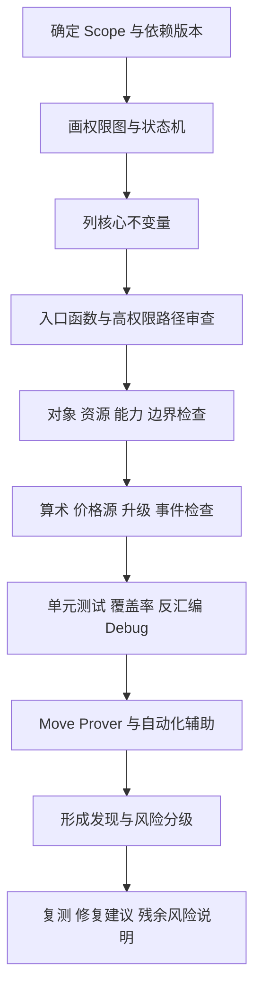
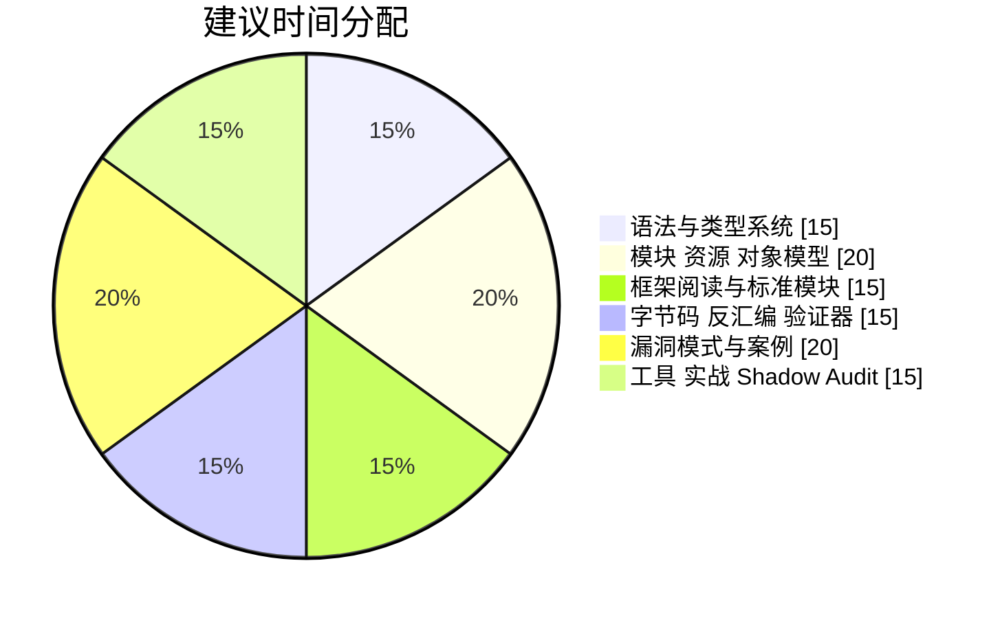

# 快速学习 Move 语言并达到代码审计能力的研究报告

## 执行摘要

如果目标不是“会写一点 Move”，而是“能做 Move 代码审计”，最短路径并不是先刷生态项目，而是先建立四层能力：第一层是 **语言正确性**，也就是语法、类型系统、能力（`copy / drop / store / key`）、模块边界与资源语义；第二层是 **链实现差异**，尤其要分清 Aptos 与 Sui 对 Move 的扩展——前者把对象、FA 标准、函数值与对象 capability 风险写进了官方安全指南，后者把全局存储改造成对象中心模型，并把显式对象输入、共享对象与升级模型作为审计重点；第三层是 **字节码与工具链**，因为 Move 的能力系统和验证器约束最终都落实在字节码层，审计时不能只停留在源码；第四层才是 **真实漏洞模式与审计流程**，也就是 capability 泄漏、权限错误、价格源失真、升级兼容、精度损失、函数值回调等高频问题。

官方/原始资料已经足够搭起一条高质量学习路径：原始 Move 论文解释资源与 VM 设计；Move 官方代码库明确 compiler、bytecode verifier、prover、package manager 的真实组成；Diem/Libra 论文给出语言设计初心；Move Prover 论文与官方指南给出形式化验证入口；Aptos 与 Sui 官方文档分别覆盖对象模型、entry 语义、测试、覆盖率、反汇编与升级；公开审计报告则把“语言保证之外，协议仍会怎样出错”展示得非常具体。

因此，本报告的核心结论是：**已有区块链与智能合约基础的读者，可以用 8 周把 Move 学到“能够独立完成小到中等复杂度项目初审/影子审计”的程度**；但前提是学习顺序必须从语言与资源语义开始，穿过字节码与工具链，再进入真实协议代码与公开审计案例，而不是直接从 DeFi 项目源码起步。下面的结构按照这个目标来展开：先给出能力里程碑，再给出主题学习矩阵、漏洞案例库、审计流程与工具栈、开源项目阅读清单，以及可执行的 8 周学习计划。

## 目录

- 学习目标与能力里程碑
- 核心主题学习矩阵
- 漏洞类型与案例库
- 审计流程与工具栈
- 开源项目阅读清单
- 八周学习与实战计划

## 学习目标与能力里程碑

Move 审计的实质不是记住语法，而是把“**资源不可复制/不可隐式丢弃**、**能力决定可执行的字节码动作**、**模块边界就是默认封装边界**、**不同链对对象/存储/升级的实现并不相同**”这四件事内化成日常检查习惯。原始 Move 论文把资源、字节码和 VM 的关系说明得非常清楚；Aptos 的安全指南则把泛型、位移、对象 capability、函数值回调、资源锁等审计高频点系统化了；Sui 的文档进一步说明了对象中心存储、显式输入对象和升级兼容性为何会改变审计思路。


| 能力里程碑 | 你应该能做到什么 | 最低验收标准 |
|---|---|---|
| 语言正确性 | 读懂 Move 基本语法、引用、泛型、abilities、abort 与测试注解 | 能独立写出 300–500 行带 `#[test]` 的小包，并解释每个 struct 为什么需要或不需要 `copy/drop/store/key` |
| 资源与模块边界 | 理解模块封装、资源所有权、能力约束、friend/visibility、对象账号与对象 ID | 能指出一个模块内哪些状态只能模块内构造/修改，哪些能力一旦泄漏就构成资产风险 |
| 交易入口理解 | 区分 legacy scripts、`public entry fun`、view/pure 模式、签名者/上下文 | 能把一个旧式 script 迁移成 entry 风格，并说明接口安全差异 |
| 框架阅读能力 | 阅读官方框架与标准模块，如 `coin`、`fungible_asset`、token/object 标准、Sui object/kiosk | 能画出模块间调用关系与核心状态机 |
| 字节码与验证器能力 | 使用反汇编、source map、debugger 核对源码与字节码行为 | 能对一个关键函数做最小字节码 walkthrough，知道何时必须看 `--disassemble` |
| 漏洞模式识别 | 识别 capability 泄漏、权限控制、对象混放、泛型缺约束、价格源失真、升级问题等 | 能对 5 段脆弱代码写出 exploit path 和 patch sketch |
| 自动化与证明 | 使用 unit test、coverage、analyzer、prover、debugger、fuzzer 做辅助验证 | 至少为一个 package 写 2 条 spec，跑通 1 次 prover 与 1 次覆盖率 |
| 审计输出 | 形成 scope、invariant、risk、PoC 思路、修复建议、残余风险说明 | 能完成一份 2–5 页的 mini audit memo |

## 核心主题学习矩阵

下表按“先语言后字节码、先官方后生态、先小包后协议”的顺序排列。资源链接优先给官方/原始资料；如果原始资料是英文，我在“关键概念”与“练习”里已经给出中文学习重点。Aptos 有中文入口，但 Move 相关正文当前多会跳转到英文页面；中文补充更适合用 Starcoin 的 Move Prover 教程 和 Move Book 中文版教程。

| 主题 | 关键概念摘要 | 推荐学习资源 | 示例代码片段或小练习题 | 常见错误与检测方法 | 优先顺序 | 预计时间 |
|---|---|---|---|---|---|---|
| 语法与类型系统 | 先吃透值语义、引用、泛型、abilities、abort、tuple-like 多返回值；Move 的“线性”不是口号，而是审计时判断资产是否会被复制/丢弃的基础。 | 官方 Abilities 文档；The Move Book；Move Tutorial 中文版；原始 Move Tutorial | 练习：写 `Receipt<phantom T>`、`Vault<T>` 与 `inc/dec` 计数器；要求对下溢和错误类型参数分别触发编译错误或 abort。 | 错把 `copy` 当默认；忘记某字段会把 struct 的 abilities 一起限制；把可变引用带出太久。检测：编译器错误、unit test、review 时逐个 struct 做 ability 表。 | 最高 | 8–12 小时 |
| 模块与资源模型 | 模块是安全边界，资源是资产边界，ability 是指令边界；Aptos 还要再叠加对象能力与对象账号隔离，Sui 则改成对象中心模型。 | Modules and Scripts；Aptos Move 安全指南；Sui Move Concepts | 练习：实现只允许 owner 提款的 `Vault`；再写一个故意返回 capability 的反例，并解释为什么危险。 | 最大误区是“模块 private 就自动安全”；真实问题往往出在 capability 返回、对象混放、friend 面太大。检测：列 privilege graph，标出谁能 mint、burn、transfer、upgrade。 | 最高 | 10–14 小时 |
| 交易脚本与 entry 入口 | 审计时要能同时读懂历史 script 风格与现代 entry 风格。Aptos 仍保留 scripts 编译路径，但真实项目主流是发布模块 + 交易 payload；Sui 更强调 `entry` 与 `TxContext`。 | Modules and Scripts；Compiling Move Scripts；Sui Move Concepts | 练习：把一个 `script { fun main(...) { ... } }` 重写成 `public entry fun`；再把转账副作用移出核心计算函数。 | 错误模式：把业务逻辑和 `transfer` 写进同一核心函数；混淆 `signer`、`address` 与 `TxContext`。检测：接口审查，标记所有 entry 的 side effect。 | 高 | 6–8 小时 |
| 字节码、VM 与验证器 | Move 的安全性很大一部分靠 bytecode verifier；审计者必须理解 binary format、CFG、source map、反汇编与 verifier 的边界。只看源码不够。 | Move 原始论文；Move 官方代码库；Sui CLI `--disassemble` 文档；Move Trace Debugger；Movetool 介绍；Zellic 的 verifier 漏洞分析 | 练习：对同一 package 跑一次 `sui move build --disassemble`，手动把一个关键函数的源码块映射到反汇编块；记录哪些局部变量在 trace 里“消失”了。 | 错误模式：相信“源码里有检查就等于链上执行也会保留同等结构”；忽视优化、CFG 与 verifier 行为。检测：反汇编、debug trace、阅读 verifier error。 | 最高 | 12–16 小时 |
| 编译器与工具链 | 真正的审计工作流离不开 `Move.toml`、named addresses、依赖解析、test mode、coverage、docgen、verify-package。 | Packages 参考；Aptos CLI Move 合约指南；Sui Move CLI 文档 | 练习：分别创建一个 Aptos 包和一个 Sui 包，跑 `compile/test/coverage/disassemble`；再故意把 named address 配错，看错误信息如何暴露依赖问题。 | 错误模式：named address 没锁死、测试目录没纳入 CI、只跑 happy path。检测：CI 中固定 `test + coverage + disassemble`。 | 高 | 8–10 小时 |
| 常见漏洞与利用模式 | Move 不是“没有漏洞”，而是漏洞重心偏到 capability、对象所有权、权限、精度、upgrade、预言机与不变量。 | Aptos Move 安全指南；Zellic 的 Aptos Move 常见 bug 总结；Zellic 的 Sui 安全 Primer；Sui Foundation 公开审计仓库 | 练习：对 5 段脆弱代码分别写出“前置条件—攻击面—触发路径—修复原则”；重点练对象/能力类问题，而不只是算术。 | 最常见错误是把 Move 的语言级安全误当成协议级安全。检测：预先写 invariant sheet，逐个函数对照检查。 | 最高 | 16–20 小时 |
| 审计流程与 checklist | 审计不是“扫一遍代码”，而是先建模权限、状态机与经济不变量，再做入口、状态迁移、边界值、升级与事件观测的系统检查。 | MoveBit 公开审计报告样本；LayerBank 报告；Cetus 报告；Sui Foundation 审计列表 | 练习：对一个小包写 mini audit memo，至少包含：scope、trusted roles、核心不变量、发现、修复建议、残余风险。 | 错误模式：没有 scope diff、没有 threat model、没有 state transition 图。检测：用 checklist 强制收口。 | 高 | 10–12 小时 |
| 自动化工具与形式化验证 | unit test 解决回归，coverage 解决盲区，analyzer 解决编辑期反馈，prover 解决逻辑性质，debugger/反汇编解决运行与字节码层核对，fuzzer/静态扫描解决异常路径覆盖。 | Move Prover Overview；Move Prover Guide；sui-move-analyzer 仓库；Sui Move Analyzer 教程；Sui Fuzzer；MoveScanner | 练习：为一个 `Vault` 包增加 2 条 spec、1 次 prover、1 组 `expected_failure` 测试和 1 次 disassemble review。 | 错误模式：把工具输出当最终结论；或者完全不用工具。检测：要求“工具发现 + 人工复核 + 最终 patch rationale”三联。 | 高 | 10–14 小时 |
| 实战练习与 shadow audit | 最终目标不是背知识点，而是把知识迁移到真实协议：框架模块、示例合约、中型 DeFi、公开审计报告对照。 | aptos-core 官方仓库；Sui 官方仓库；Liquidswap 仓库；DeepBook V3 仓库 | 练习：选 1 个中型协议做 shadow audit，输出 risk register、疑点列表、修复建议、与公开报告对照。 | 错误模式：只看 README，不建控制流与状态图；只看 happy path，不做 adversarial walkthrough。检测：必须提交一份可读的审计 memo。 | 最高 | 20–28 小时 |

## 漏洞类型与案例库

Move 的语言设计确实天然消除了部分经典 EVM 问题，但公开案例已经反复证明：**协议层、经济层、对象/capability 层和升级层的错误仍然非常常见**。官方安全指南把这些风险系统化了；Zellic 的 Aptos/Sui 安全文章 与公开审计报告又把这些问题落成了真实项目中的 bug class。下面我列出 10 类在真实审计里最常见、也最值得优先练习的漏洞。

**权限控制缺失或校验位置错误**

```move
public entry fun add_token(admin: &signer, token: address) acquires Config {
    let cfg = borrow_global_mut<Config>(@protocol);
    // 缺少 is_admin(admin) 或角色校验
    vector::push_back(&mut cfg.supported_tokens, token);
}
```

检测方法：先列角色矩阵，再反查所有 `entry/public` 写状态函数，确认每条写路径都经过正确角色校验，而且校验发生在状态修改之前。修复建议：把权限验证抽成统一守卫函数，并在初始化、管理员变更、敏感配置更新、mint/burn/upgrade 前强制调用。参考案例可以看 Amnis Finance 的 公开审计报告 中 `GOV-2` 与 `STO-1`，以及 LayerBank 的 公开审计报告 中 `ERV-2`。

**Capability / Ref 泄漏**

```move
public fun mint(creator: &signer): ConstructorRef {
    token::create_named_token(/* ... */)
}
```

检测方法：逐个检查返回值、事件、存储字段与 helper 函数，确认 `ConstructorRef`、`TransferRef`、`MintCap`、`BurnCap` 等能力是否被返回、是否被意外持久化、是否暴露给下游模块。修复建议：能力默认不出模块；如果必须外发，只给最小权限版本，并设计回收/撤销路径。Aptos 官方安全指南直接把 `ConstructorRef leak` 作为高风险反模式示例。

**对象账号混放导致所有权串联**

```move
#[resource_group_member(group = 0x42::example::ObjectGroup)]
struct Monkey has store, key {}

#[resource_group_member(group = 0x42::example::ObjectGroup)]
struct Toad has store, key {}
```

检测方法：在 Aptos 对象模型下，检查一个对象账号里是否容纳了多个逻辑上应独立转移的对象；只要 transfer 是对 `ObjectCore` 生效，就要追问“会不会一起被带走”。修复建议：不同资产/实例尽量隔离到不同对象账号，避免用同一个对象账号承载多个需独立转移的成员。这个坑在 Aptos 官方安全指南的 `Object Accounts` 一节有非常直观的反例。

**泛型类型检查不足与 phantom 约束缺失**

```move
public fun withdraw<T>(vault: &mut Vault, amount: u64): Coin<T> {
    // 未确保 vault 内资产类型和 T 一致
    abort 0
}
```

检测方法：盯住所有泛型入口，尤其是 `Coin<T>`、`Table<K, V>`、wrapper/witness 类型和跨模块泛型参数；审计时要问两个问题：类型参数是否被真正约束了？是否应该用 `phantom` 来消除错误的运行时组合？修复建议：给类型参数加最小必要约束；对纯标签型参数使用 `phantom`；跨模块接口尽量让类型信息嵌进资源本身，而不是依赖调用者自觉。Aptos 官方安全指南明确把 “unchecked generics” 视为会导致未授权操作或不必要 abort 的风险。

**算术溢出、位移例外与精度损失**

```move
let reward = amount * rate / total;
let shifted = amount << n; // 左移不会像普通算术那样在溢出时 abort
```

检测方法：对金额、份额、费率、指数、累积器逐条做“单位、上界、下界、舍入方向”检查；特别检查 Move 中左移 `<<` 的特殊行为，以及所有先乘后除的定点计算。修复建议：对关键金额统一使用固定精度库或显式中间类型；必要时先提升位宽再计算；明确规定 rounding direction；把极值样例写进测试。公开案例方面，Cetus 的 公开审计报告 列出了 `REW1-1 Precision Loss`，而 Amnis Finance 的同类报告中也有 `Missing Validation ... May Lead to Computational Overflow`。官方安全指南还专门提醒左移不会在溢出时 abort。

**价格预言机过期、有效期过长或指数计算错误**

```move
let p = oracle::get_price();
assert!(p > 0, E_BAD_PRICE);
// 没有检查 staleness、expo、validity period
```

检测方法：把所有价格读取点画出来，检查：数据源是谁、有效期多久、指数 `expo` 如何处理、是否为不同资产设置不同 freshness、清算和报价是否使用同一价格语义。修复建议：强制 stale check，按资产风险设差异化有效期，封装统一的 price normalization 层，不允许业务代码自己拼指数。真实报告里这类问题极其高频：Auro Finance 的 公开审计报告 有 `ORA-1/2/3`，LayerBank 的报告有 `ORA-1/2/3` 与 `GLO-1`，Nemo Protocol 的报告则指出 `get_price_no_older_than` 需要自定义 expiry 以防止 Pyth 价格过期。

**升级/版本兼容检查缺失**

```move
public entry fun add_operator(cfg: &mut Config, op: address) {
    // 缺少版本断言或布局兼容保护
    vector::push_back(&mut cfg.operators, op);
}
```

检测方法：对所有升级入口、migration 逻辑和读旧状态的 helper 函数，检查是否有明确 version gate、layout compatibility 假设与回滚策略。修复建议：状态中显式记录版本；升级函数先验版本、再迁移、再切换；对外接口尽量稳定。参考案例：Cetus 的公开报告中 `CON-1` 就是缺少 contract version check；Sui 官方升级文档则强调旧 package 不会消失、`init` 不会在升级后重跑、且布局必须兼容。

**函数值回调引发的重入与资源锁误解**

```move
public fun execute(cb: |&mut Vault|, v: &mut Vault) {
    cb(v);        // 动态回调
    settle(v);    // 假设 v 的状态仍满足旧不变量
}
```

检测方法：凡是使用 function values、closure、callback 的地方，都要把调用图改画成“可能回调源模块”的图；检查回调前后哪些资源被借用、哪些状态被锁、哪些不变量会被打破。修复建议：关键状态在回调前先完成冻结/结算；避免把未完成的中间状态暴露给 callback；对敏感模块限制 function value 的可存储/可重入使用。Aptos 官方安全指南明确指出：函数值不自动防重入，回调可重入原模块；同一份指南还说明了动态派发中的资源锁限制。

**单步管理员转移**

```move
public entry fun change_admin(admin: &signer, next: address) acquires Config {
    assert!(is_admin(admin), E_NOT_ADMIN);
    borrow_global_mut<Config>(@protocol).admin = next;
}
```

检测方法：特别检查 owner/admin/guardian/operator 的转移函数，问自己：如果传错地址，会不会不可逆？中途能否撤销？新地址是否明确接受？修复建议：改成两步式：提名 + 接受；必要时加 timelock 与事件。Enjoyoors 的 公开审计报告 直接把 `Single-step Ownership Transfer Can be Dangerous` 列为问题，并给出两步式修复建议。

**参数校验缺失与零值边界条件**

```move
public entry fun increase_supply_limit(delta: u64) acquires Limits {
    let l = borrow_global_mut<Limits>(@protocol);
    l.max = l.max + delta; // 没校验 delta > 0
}
```

检测方法：枚举所有外部输入参数，重点检查 `0`、空向量、空字符串、重复值、极大值、未初始化对象等边界条件。修复建议：把参数校验前置到 entry 层；对“逻辑上必须大于 0”的量写成显式断言，而不是依赖上层 UI。公开案例可见 Enjoyoors 报告中对 `increase_supply_limit` / `decrease_supply_limit` 缺少 `delta > 0` 校验的说明。

**只审源码、不审字节码与验证器边界**

```move
// 不是源码某一行的问题，而是审计流程的问题：
// 只读 source，不跑 disassemble / debugger / verifier 相关检查
```

检测方法：凡涉及高价值逻辑、复杂控制流、编译器新特性或 verifier error 的函数，都至少做一次反汇编核对；必要时借助 debugger 看执行 trace。修复建议：把“关键路径 must inspect bytecode”写进团队流程。这个要求不是学术洁癖：Zellic 的 verifier 漏洞分析 展示过 Move bytecode verifier 的 CFG 构造 bug 如何绕过多项安全性质；Sui 的官方 debugger 也明确指出，优化存在时反汇编视图才是 ultimate source of truth。

## 审计流程与工具栈

公开的 Move 审计报告虽然来自不同团队，但方法论 surprisingly 一致：先做 scope/architecture review，再做 testing 与 automated analysis、manual review，关键函数再加 formal verification 或至少不变量验证。MoveBit 的多份公开报告都把 `Testing and Automated Analysis`、`Code Review` 和 `Formal Verification` 明确写进 methodology；Aptos 官方也把 CLI、coverage、prover 串成了完整的日常工作流。



审计 checklist 最好按“**权力—状态—数值—升级—可观测性**”五个面来收口，而不是按文件目录机械扫。下面这张表可以直接拿去做初审模板。它综合了官方安全指南、Sui/Aptos 文档和公开审计方法论。

| 审计维度 | 必查问题 | 快速证据 |
|---|---|---|
| 权限与角色 | 谁能初始化、升级、改参数、mint、burn、pause、claim、迁移？是否存在漏检、错检、单步转移？ | role matrix、owner/admin/operator 列表、入口函数签名 |
| 资源与能力 | 任何 capability/ref 是否被返回、持久化或跨模块泄漏？abilities 是否最小化？ | 搜索 `Ref`、`Cap`、`key/store/copy/drop`；检查返回值与字段 |
| 对象与所有权 | Aptos 是否有对象账号混放？Sui 是否正确区分 owned/shared/immutable object？ | 对象创建/分享/转移路径图 |
| 数值不变量 | 金额、份额、利率、指数、清算阈值、舍入方向是否自洽？ | 极值测试、定点公式、单位表 |
| 外部数据 | 预言机 freshness、指数处理、容错与 fallback 是否合理？ | 每个 `get_price` 调用点的 validity check |
| 升级与版本 | 是否有 version gate？布局兼容吗？`init` 是否被误以为会重跑？旧包还能被访问吗？ | migration 函数、version 常量、upgrade policy |
| 事件与可观测性 | 关键参数变更、角色变更、清算、费用提取、升级是否发事件？ | event struct 与 emit 点 |
| 测试与证明 | 是否覆盖边界值、错误路径、权限路径、极端价格、升级迁移？有无 prover/spec？ | `#[expected_failure]`、coverage、prove 输出 |
| 字节码与调试 | 关键路径是否做过反汇编检查？source 与 trace 是否一致？ | `--disassemble` 产物、debugger trace |

下面这张工具表给的是**学习 + 审计都能直接上手**的组合，而不是堆一堆名词。优先级上，CLI、反汇编、单元测试、debugger、prover 是第一组；analyzer、fuzzer、scanner 是第二组。工具特性来自各自官方文档或仓库说明。

| 工具/资源 | 用途 | 优点 | 缺点 | 安装难度 | 是否开源 | 链接 |
|---|---|---|---|---|---|---|
| Aptos CLI | 编译、测试、覆盖率、prove、verify-package | 官方一站式；覆盖学习与审计基础流程；coverage/prover 入口统一 | 对新手来说参数较多；named address 与依赖解析容易踩坑 | 中 | 是 | Aptos CLI 文档 |
| Sui CLI | 构建、测试、反汇编、发布、包管理 | `--disassemble` 很适合审计；与 Sui 包模型结合紧 | 更偏 Sui；跨链通用性不如 core Move 工具 | 中 | 是 | Sui Move CLI 文档 |
| Move Prover | 形式化规格与验证 | 能把关键不变量写成 machine-checkable 规则；适合高价值路径 | 学习曲线高；证明失败诊断需要耐心 | 中到高 | 是 | Move Prover Overview / User Guide |
| move-analyzer / sui-move-analyzer | 编辑期诊断、跳转、补全、局部静态分析 | 提升阅读与改代码效率；适合日常工作流 | 不是审计结论工具；复杂项目上仍需人工复核 | 低到中 | 是 | sui-move-analyzer 仓库 |
| Sui Trace Debugger | 执行级调试、source/disassembly 对照 | 对复杂状态路径和 trace 很有用；能把“这行代码究竟怎么执行”看清楚 | 主要服务 Sui；不能替代形式化审查 | 中 | 依附开源 Sui 工具链 | Move Trace Debugger |
| move-disassembler / 反汇编工作流 | 审关键路径字节码与 source map | 直接看到 verifier/optimizer 后的真实执行形态 | 学习门槛高，不适合当第一工具 | 中 | 是 | Move 官方代码库 |
| Movetool | 审计研究、字节码格式学习 | 对 bytecode auditor 很有教育价值；能强迫你理解 binary format | 更偏研究/高级审计，不是入门首选 | 高 | 可公开获取资料有限，适合作补充 | Movetool 介绍 |
| Sui Fuzzer | 模糊测试、异常路径探索 | 对状态机与边界路径很有帮助 | 生态成熟度不如 EVM fuzzing；需要自己设计 harness | 中到高 | 是 | Sui Fuzzer |
| MoveScanner | 静态扫描与批量风险发现 | 适合大仓库做 first pass triage | 不能替代手工审计；官网未见公开仓库，透明度一般 | 低到中 | 未见公开仓库 | MoveScanner |

## 开源项目阅读清单

最有效的阅读顺序不是“找最火的协议”，而是 **官方最小示例 → 官方框架模块 → 生产级协议**。前两类解决语言与模型理解，第三类才开始锻炼你识别真实风险与业务不变量的能力。官方核心代码建议优先读 aptos-core、Sui 仓库 与 Sui & Move Bootcamp。

| 难度 | 项目/合约 | 简短说明 | 关键文件路径 | 建议关注点 |
|---|---|---|---|---|
| 入门 | `aptos-core / hello_blockchain` | 最小状态读写示例，适合理解 package、entry、测试与 named address | `aptos-move/move-examples/hello_blockchain/sources/` → hello_blockchain.move | 入口函数、状态读写、测试最小闭环 |
| 入门 | `aptos-framework / managed_coin` | 最适合入门 coin capability 模型 | `aptos-move/framework/aptos-framework/sources/` → managed_coin.move | mint/burn capability、register、权限边界 |
| 入门 | `sui / basics` | Sui 官方对象基础示例 | `examples/move/basics/sources/` → object_basics.move | `UID`、对象创建、owned object 心智模型 |
| 入门 | `sui-move-bootcamp / C1` | 面向学习者的 capability 模式模块 | `C1/` → C1/README.md | publisher/capability 模式、教学式练习 |
| 进阶 | `aptos-framework / coin` | 经典 Coin 资源模型，资源与事件很适合做审计练习 | `aptos-move/framework/aptos-framework/sources/` → coin.move | 能力管理、转账路径、事件与账户交互 |
| 进阶 | `aptos-framework / fungible_asset` | Aptos 新 FA 标准的核心实现 | `aptos-move/framework/aptos-framework/sources/` → fungible_asset.move | 对象化资产、可组合性、与 legacy coin 的差异 |
| 进阶 | `aptos-token-objects` | 对象版 token 标准 | `aptos-move/framework/aptos-token-objects/sources/` → token.move / aptos_token.move | object token 元数据、transfer 语义、对象权限 |
| 进阶 | `aptos move-examples / mint_nft` | 从教学示例过渡到更完整的 NFT 逻辑 | `aptos-move/move-examples/mint_nft/.../sources/` → create_nft.move / production-ready 版本 | collection/token、事件、生产化补丁 |
| 进阶 | `sui / trading escrow` | Sui 官方 trustless swap 示例 | `examples/trading/contracts/escrow/sources/` → shared.move | shared object、原子交换、对象并发 |
| 高阶 | `Mysten apps / kiosk` | Sui 生产级资产交易原语，规则系统很适合做审计练习 | `kiosk/sources/rules/` → royalty_rule.move / personal_kiosk_rule.move | 规则系统、费用/版税、策略扩展 |
| 高阶 | `deepbookv3` | Sui 官方级 CLOB 协议代码，复杂度高 | `packages/deepbook/sources/` → pool.move；`packages/deepbook_margin/sources/` → margin_pool.move | 账户抽象、撮合逻辑、margin 状态机 |
| 高阶 | `liquidswap` | Aptos 上代表性的 AMM Move 协议 | `sources/swap/` → liquidity_pool.move / router.move | 池子状态、不变量、曲线与路由 |
| 高阶 | `post_mint_reveal_nft` | 更接近真实业务的 NFT 状态机示例 | `aptos-move/move-examples/post_mint_reveal_nft/sources/` → minting.move | reveal 流程、配置状态、测试覆盖 |
| 高阶 | `redemption` | 小而完整、适合做独立 shadow audit 的真实仓库 | 仓库根目录 `sources/` → Thala redemption 仓库 | immutable package、verify-package、最小真实项目审查 |

如果你要把阅读效率拉满，我建议每个项目都固定产出三样东西：**权限图、状态机图、风险登记表**。没有这三样产物，阅读通常只是“看懂了”；有了这三样，才会逼自己从开发视角切到审计视角。这个方法特别适合拿上表里的 `coin.move`、`fungible_asset.move`、`shared.move`、`kiosk` 和 `liquidity_pool.move` 做训练。

## 八周学习与实战计划

下面的计划按“每周 10–20 小时”设计；如果没有特殊约束，建议你取中位数 **12–15 小时/周**：工作日 5 天每天 1.5–2 小时，周末再安排 1–2 次 2–3 小时深度练习。这样既能持续，又足以支撑代码阅读、测试、做笔记和写 mini report。时间分配上，前半程要押注语言/资源/字节码，后半程要押注漏洞与实战。这个配比是为了最大化“8 周后能审”的收益，而不是追求“资料读得最多”。 



| 周次 | 周目标 | 练习安排 | 评估方法 |
|---|---|---|---|
| 第 1 周 | 建立环境与最小语言正确性心智 | 安装 CLI、analyzer；完成 2 个最小包：计数器与 `Vault<T>`；写 6–10 个单元测试，覆盖 `abort`、错误类型、边界值 | 能独立解释 `copy/drop/store/key`，并提交一个带 `#[expected_failure]` 的最小工程 |
| 第 2 周 | 吃透模块、资源、权限与对象差异 | 读 `managed_coin.move`、`coin.move`、`object_basics.move`；自己画权限图与资源流 | 口头或书面回答：谁能构造状态、谁能销毁状态、谁能转移状态、谁能升级 |
| 第 3 周 | 吃透交易入口、包管理、测试与覆盖率 | 把一个 script 风格示例改成 entry 风格；跑 `aptos move test --coverage`；整理 `Move.toml` 与 named address 踩坑清单 | 提交 coverage 结果与一页“入口函数设计 review” |
| 第 4 周 | 字节码、反汇编、debugger 入门 | 对一个小包运行 `sui move build --disassemble`；使用 debugger 走一条关键路径；阅读 verifier bug 文章 | 产出一份“源码—字节码对应表”，至少覆盖 1 个关键函数 |
| 第 5 周 | 漏洞模式密集训练 | 用本报告的 10 类漏洞，手工给 10 段脆弱代码做 exploit path + patch sketch；开始阅读公开审计 summary 页 | 能在不看答案的情况下，归类并修复至少 6 类高频漏洞 |
| 第 6 周 | 工具与 formal verification 真正落地 | 给 `Vault` 或 NFT 小项目加 2 条 spec，跑 prover；再用 analyzer、coverage、disassemble 做一次组合审查 | 提交 prover 输出、1 份 spec 文件、1 份错误分析说明 |
| 第 7 周 | 阅读中型真实项目并做 shadow audit | 从 `liquidswap`、`deepbookv3`、`kiosk`、`fungible_asset` 中选 1 个做 shadow audit；先写 invariant，再审代码 | 输出 2–5 页 mini audit memo，包含 3–5 条发现或潜在风险 |
| 第 8 周 | 对照公开报告复盘并形成个人方法论 | 把自己的发现和公开报告对照；补齐误判；整理个人 checklist、风险分类和常用命令模板 | 形成一份可重复使用的审计模板包：checklist、命令脚本、报告骨架、常见漏洞笔记 |

如果按这个节奏执行，到第 8 周结束时，你至少应能达到下面这个实战标准：**面对一个 500–2000 行的 Move package，能够独立完成 scope 识别、权限图绘制、核心不变量列表、关键入口检查、一次反汇编复核、基础 prover/测试辅助验证，以及一份结构化审计 memo。** 这已经足够进入“初级审计者/影子审计者”状态；之后要继续提升，最有效的方式不是继续泛读资料，而是持续把公开报告、官方框架代码和真实协议的 patch diff 放在一起对照。