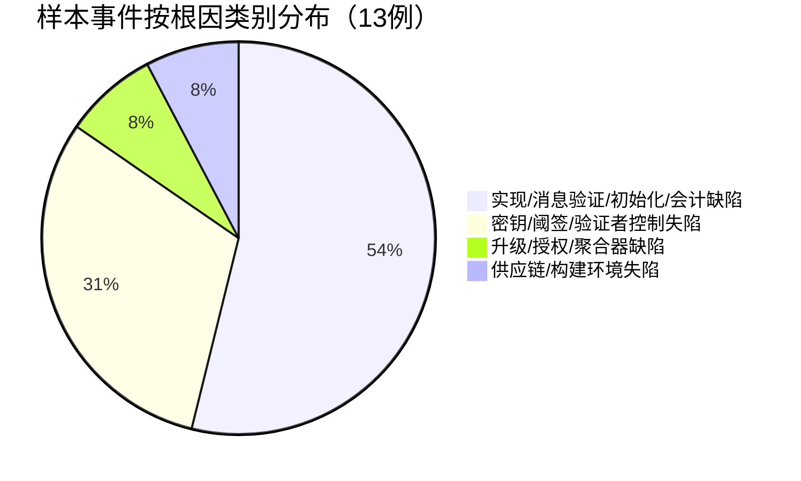
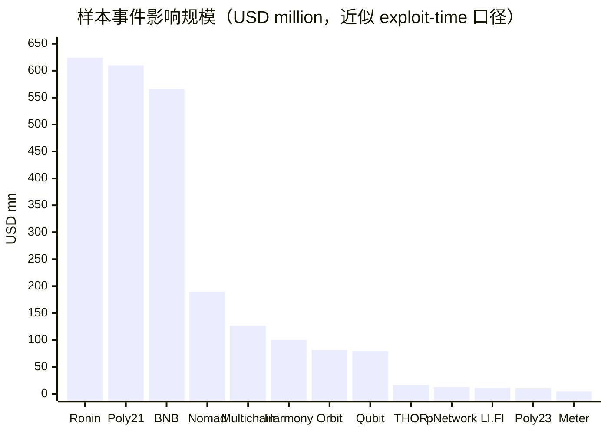
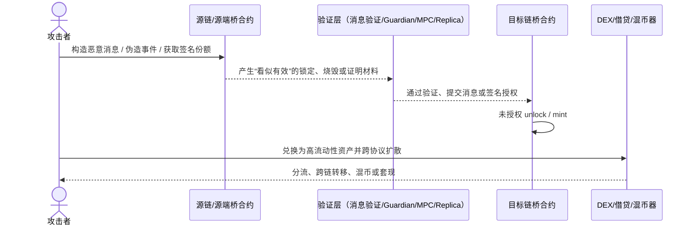

# 跨链桥在区块链系统中的重大漏洞与研究重点风险报告

## 执行摘要

跨链桥已经从“资产搬运工具”演变为多链生态的关键基础设施：它们不仅搬运代币，还承载任意消息、流动性重平衡、治理升级与跨域结算。然而，桥的安全边界并不等于某一条链本身的安全，而是“源链状态证明 + 目标链执行 + 中间验证者/中继者/流动性提供者 + 升级与密钥管理”这条完整链路中最薄弱的一环。因此，跨链桥在实践中反复成为最高损失级别的攻击目标。公开资料显示，桥类攻击累计已造成超过 28 亿美元损失，约占 Web3 历史被盗金额的近 40%；而学术系统综述已将近年桥攻击总结为 12 类潜在攻击面、10 类漏洞类型，说明问题不是“偶发编码失误”，而是体系级工程与信任建模缺陷。citeturn23search18turn36search2turn36search13turn35search0

本报告的核心判断有四点。第一，**损失规模最大**的事件往往来自密钥、阈签、多签和验证者控制权失陷，例如 Ronin、Harmony、Multichain、Orbit；第二，**发生频率最高**的事件则更多来自实现与验证逻辑缺陷，例如 Poly Network 2021、THORChain、pNetwork、Qubit、Meter、Nomad、BNB Token Hub 与 LI.FI；第三，桥的“高可连接性”通常以引入新的外部信任为代价，因此“连接更多链、支持任意消息、支持更复杂升级”的系统往往同时扩大了故障半径；第四，聚合器、适配器和消息层正在成为新的风险集中层，攻击者已经不必总是突破底层桥，只要突破其上层的授权、升级或适配逻辑，就能形成跨协议级联损失。citeturn40view0turn37search0turn37search5turn39search0turn39search8turn38search2turn38search9

研究者因此不应只把跨链桥视为“锁仓合约”或“多签金库”。更准确的分析框架，是把桥拆成五个相互耦合的子系统：**资产托管、消息验证、资产会计、权限/升级、运维/密钥**。很多真实攻击并不是直接“偷金库”，而是先污染消息验证、伪造事件、篡改升级路径、劫持签名流程，最后才触发解锁或铸币。这也是为什么同样是“桥被盗”，其根因可能分别位于 Solidity 业务逻辑、Rust 事件解析器、MPC 节点云账户、初始化参数、Facet 升级过程，甚至构建环境与供应链。citeturn36search1turn36search2turn36search16turn40view0

本报告覆盖 2019–2026 年的近五年重点区间，但将“经典早期模式”纳入设计分析视角；事件部分以 2021–2024 年的代表性漏洞为主，这是桥攻击最密集、损失最大、证据最完整的阶段。金额口径优先采用项目官方或 contemporaneous 安全/取证报告的 exploit-time USD 估值；若同一事件存在“影响规模”和“最终净外流规模”两种口径，表中会明确区分。citeturn35search0turn45view0turn15search1turn29search0

## 设计模式、信任模型与主要攻击面

跨链桥可以从**通信机制**与**验证机制**两条轴线来理解。按通信机制看，主流模式包括锁定-铸造、燃烧-释放、燃烧-铸造、原子交换/HTLC、流动性网络与任意消息传递；按验证机制看，则可分为原生/轻客户端验证、外部验证者/委员会验证、乐观验证、以及带多签或 MPC 的托管式桥。以太坊开发者文档和近两年的 SoK 文献都强调：不存在“完美桥”，只有不同安全、速度、连接性与资本效率之间的权衡。citeturn40view0turn36search2turn36search13

**表一：设计模式对照表**

| 设计模式 | 典型机制 | 主要信任假设 | 优点 | 主要缺点/风险 | 典型项目 |
|---|---|---|---|---|---|
| 锁定-铸造 / 燃烧-释放 | 源链锁定原生资产；目标链铸造映射资产；反向桥回时燃烧映射资产并释放原资产 | 桥托管合约、验证器/中继层不会伪造锁定事实；映射资产供应与托管储备始终 1:1 | 直观、资本效率高、易支持多链扩展 | 映射资产形成系统性风险；桥托管金库成为高价值单点；消息错误可直接导致“无抵押铸币” | Wormhole WTT、Poly Network、pNetwork、Multichain 早期 anyToken |
| 燃烧-铸造 | 源链直接销毁代币，目标链按消息/证明铸造等量原生或准原生资产 | 发行方/协议 attestation 正确；不会伪造 burn 事件或签名 | 不需要长期锁仓和 wrapped token 池；避免部分桥接资产碎片化 | 发行方或 attestation 服务构成新信任点；升级和签名逻辑风险高 | entity["company","Circle","stablecoin issuer"] CCTP、CCIP Burn&Mint |
| HTLC / 原子交换 | 两链用哈希锁和时间锁完成原子兑付 | 双链 liveness 正常、超时参数正确、对手方与路由不作恶 | 不需要全局托管；理论上可高度信任最小化 | UX 差、吞吐低、消息能力弱、易受超时与流动性约束 | 早期 BTC-LTC 原子交换；部分跨链兑换协议 |
| 多签 / 阈值签名 / MPC 托管桥 | 外部签名人达阈值后对解锁/铸币授权 | 足够多签名份额不被攻破，且签名策略、云环境、HSM/MPC 不失陷 | 支持快、接入链多、工程落地相对容易 | 一旦阈值被拿下，攻击者可直接伪造跨链操作；密钥与运维风险极高 | Ronin、Harmony Horizon、Multichain |
| 外部验证者 / 委员会桥 | Guardian/DVN/Oracle 观察源链并证明消息有效 | 外部委员会中超过阈值的节点诚实、独立且实现正确 | 灵活、支持 arbitrary message、可跨异构链 | 新增外部信任面；实现错误或委员会共谋都可能导致大规模损失 | entity["organization","Wormhole","interoperability protocol"]、entity["organization","LayerZero","messaging protocol"]、Axelar |
| 轻客户端 / 原生验证桥 | 目标链验证源链区块头、共识证明或 zk 证明 | 只额外信任两端链本身与轻客户端/证明系统实现 | 信任最小化强，理论安全上限高 | 接入复杂、成本高、对异构链支持差，轻客户端实现本身也可能出错 | IBC、zk/light-client bridge |
| 乐观桥 | 先接受消息，设置挑战窗口，通过 fraud proof 纠正 | 至少有一个诚实观察者在挑战期内在线 | 可较强信任最小化，适合任意消息 | 存在延迟；初始化/根设置错误会让“乐观假设”失效 | Nomad（历史）、部分 optimistic messaging 设计 |
| 流动性网络 / 去中心化中继 / 意图桥 | 中继者或 LP 在目标链先行垫资，再通过后续结算回补 | 中继者有偿且持续在线；结算层不会错误回补；流动性足够 | 速度快，减少全局托管和 wrapped 风险 | 依赖 relayer/LP 激励；无法天然支持复杂任意消息；路由与清算也会形成新攻击面 | entity["organization","Across","bridge protocol"]、entity["organization","Connext","interop protocol"]、entity["organization","Hop Protocol","rollup bridge"] |
| 聚合器 / 适配器层 | 上层路由多个桥与 DEX，统一授权和执行 | 聚合器本身升级、授权、适配器和路由逻辑正确 | UX 好、价格/路径优化、开发者接入快 | 叠加依赖导致级联风险；用户 approval 与 facet/adapter 升级变成高危面 | LI.FI、Socket/Bungee |

上表综合了 ethereum.org 对 lock-and-mint、burn-and-mint、atomic swaps、validator-based、generalized messaging 与 liquidity network 的分类，也参考了近两年的桥安全 SoK 以及官方文档：Circle CCTP 明确采用 burn-and-mint 与 off-chain attestation；LayerZero V2 将验证与执行拆分为 DVN 和 Executor，并允许 X-of-Y-of-N 的安全栈配置；Across/Connext 将“快速填单”和“后结算”作为流动性网络核心；Wormhole 则以 13/19 Guardian 签名的 VAA 为核心消息真实性假设。citeturn40view0turn36search2turn36search13turn38search2turn38search9turn37search0turn37search5turn37search11turn39search0turn39search8turn43view0

研究上最重要的结论是：**桥的设计模式与其最可能遭遇的根因高度相关**。多签/MPC 桥最怕密钥与权限失控；任意消息桥最怕消息验证、初始化与重放；锁定-铸造桥最怕储备/供应不匹配；流动性网络最怕结算与激励失衡；聚合器最怕授权与升级路径。也因此，审计不应只看合约本身，而必须把“验证方式、会计不变量、升级路径、签名与运维组织结构、外部依赖图”作为同等重要的审计对象。citeturn36search1turn36search2turn40view0

## 代表性事件总表与图示

下表选取 2021–2024 年 13 个代表性跨链桥/跨链适配层事件。美元金额优先采用事件发生时的官方或 contemporaneous 口径；**BNB Chain** 事件同时区分“影响规模”与“最终净外流规模”，**Poly Network 2023** 同时区分“名义铸造规模”与“可兑现价值”。**Meter** 官方明确说明其估值使用 2022-02-05 的 CoinGecko 价格。citeturn45view0turn15search1turn29search0turn29search1

**表二：事件汇总表**

| 时间 | 事件 | 设计模式 / 信任模型 | 漏洞类型 | 攻击向量、利用链路与根因摘要 | 被盗/影响规模 | 修复与后续影响 | 主要证据 |
|---|---|---|---|---|---|---|---|
| 2021-08-10 | entity["organization","Poly Network","cross-chain protocol"] | 锁定-铸造 + 外部验证/跨链消息执行 | 权限与任意调用缺陷 | 攻击者构造恶意跨链消息，经 `verifyHeaderAndExecuteTx` 进入高权限路径，篡改 keeper / 公钥后在多链发起未授权释放；根因是跨链执行入口的权限隔离与目标调用边界设计错误 | 约 $610M（后基本归还） | 资产追回；项目公开复盘并加固构建/密钥流程；成为桥 access-control 经典案例 | url官方回顾turn6search2；url慢雾根因分析turn8search3；urlPeckShield 补丁分析turn8search5 |
| 2021-07 | entity["organization","THORChain","liquidity network"] ETH Router | 流动性网络 + 外部链观察/Bifrost | 事件解析与会计逻辑缺陷 | 两次利用分别通过前置/后置恶意合约欺骗 Router 与 Bifrost，把不存在的入金解释为真实入金，再借退款与套利抽走资产；根因是 Bifrost 对 `msg.value`、恶意事件与 memo 语义处理存在错误，且 ETH Bifrost 未完成审计 | 两次各约 $8M，总体资不抵债约 $16M | Treasury 覆盖 LP 损失；之后引入审计、赏金、自动偿付检查、出金节流和红队 | url官方复盘turn41view0 |
| 2021-09-19 | entity["organization","pNetwork","ptokens bridge"] pBTC-on-BSC | 锁定-铸造 + 节点观察 peg-out 日志 | 日志提取/反序列化缺陷 | 恶意合约混入合法与伪造 peg-out 事件，Rust 日志提取器错误同时处理了真实与伪造日志，节点广播未授权 BTC 释放；根因在 off-chain log extraction 代码 | 277 BTC，约 $13M+ | 迅速停桥、修复代码、追加安全检查、DAO 讨论补偿并提供 $1.5M 赏金求返还 | url官方事后报告turn42view0 |
| 2022-01-27 | entity["organization","Qubit Finance","bsc defi protocol"] QBridge | 锁定-铸造 | 过时函数 / 资产会计缺陷 | 攻击者利用过时 `deposit()` 逻辑在未真正转入 ETH 的情况下制造入金效果，伪造 qXETH 铸造后在借贷侧抵押借出 BNB；根因是遗留函数与 wrapped/native 资产处理不一致，且转账成功性验证不足 | 约 $80M | 团队求和解赏金；事件成为“桥 + 借贷”复合攻击典型 | urlHalborn 复盘turn11search0；urlCertiK 分析turn11search1；url慢雾分析turn30search22 |
| 2022-02-05 | entity["organization","Meter","passport bridge"] Passport | 锁定-铸造 / burn-release 混合 | wrapped native 处理缺陷 | ERC20 Handler 假定包装原生资产已被正确转入，可跳过 burn/lock，攻击者借此在多网络错误铸币并兑换高流动性资产；直接损失约 $4.25M，且对 Hundred Finance 造成约 $2.135M 连锁影响 | 直接约 $4.25M；外部级联损失另计 | 社区通过 PASS 代币与 USD 责任补偿方案；规划升级到新版并设立官方赏金 | url官方复盘turn45view0 |
| 2022-03-23 / 03-29 披露 | entity["organization","Ronin Network","gaming sidechain"] Bridge | 多签/验证者阈值桥 | 私钥泄露 + 阈值过低 + 运维遗留 allowlist | 攻击者控制 4 个 Sky Mavis 验证者与 1 个 Axie DAO 验证者，伪造两笔提款；根因是 5/9 阈值过低、gas-free RPC allowlist 未撤销、验证者集中度过高与社会工程入侵 | 173,600 ETH + 25.5M USDC，约 $624M | 阈值升至 8/9、替换老验证者、扩容验证者集合、经融资与资产负债表全额赔付；FBI 归因 Lazarus，相关地址受制裁 | url官方公告与更新turn44view0；urlFBI/财政部归因turn18search15；urlOFAC 制裁地址turn18search3 |
| 2022-06-23 | entity["organization","Harmony","layer1 blockchain"] Horizon Bridge | 2-of-5 多签桥 | 私钥妥协 / 门限设置不当 | 2/5 多签被攻破后，攻击者直接签发未授权出金；根因是门限过低与密钥保管治理不足 | 约 $100M | 团队暂停桥并调查；FBI 后续归因 Lazarus；公开补偿闭环信息相对不完整、社区争议较大 | url官方公告turn3search5；urlFBI 归因turn17search5 |
| 2022-08-01 | entity["organization","Nomad","cross-chain bridge"] | 乐观桥 / 任意消息 | 初始化根设置错误 + 重放/复制攻击 | 升级后错误把可信根初始化为可被任意消息匹配的值，使第一笔伪造消息成功后，其他人只要复制 calldata 并替换收款地址就可批量搬空资金；根因是初始化与 message root 校验失败 | 超过 $190M | 停桥、与 Mandiant 等取证合作；部分资金归还；后续出现司法引渡进展 | urlHalborn 复盘turn13search1；urlMandiant 分析turn13search0；urlTRM 司法后续turn13search7 |
| 2022-10-06 | entity["organization","BNB Chain","blockchain ecosystem"] Token Hub | 轻证明 / 跨链证明验证 | 证明伪造 / IAVL 验证缺陷 | 攻击者伪造 Binance Bridge 证明，在 BSC Token Hub 上分两次非法铸出 200 万 BNB；根因在 cross-chain proof verifier/IAVL 相关验证逻辑缺陷 | 影响规模约 $566M；最终外流/可变现规模约 $90M–$110M | BNB Chain 临时停链协调冻结；后续着手改进桥验证与应急治理 | url官方更新turn15search1；urlVerichains 技术分析turn16search1；urlImmunefi 分析turn16search2 |
| 2023-07 | entity["organization","Multichain","cross-chain router"] | MPC / 外部验证 + Router | 密钥/云账户集中控制失陷 | 官方说明显示 CEO 被带走后，MPC 节点服务器访问权、私钥/助记词与资金控制都集中在个人云账户与家庭环境上；随后出现异常转出并最终停运。其问题既像“密钥失陷”，也暴露出严重组织治理与单点运维风险 | 官方与取证普遍确认异常转出 >$125M（部分资料约 $127M+） | 项目停运；法院文书与链上调查持续；该案是“协议宣称去中心化、实际运维高度中心化”的极端样本 | url官方 X 说明turn32search2；url二次转述全文turn31view0；urlChainalysis 分析turn21search6；url新加坡法院文书turn21search14 |
| 2023-07-02 | entity["organization","Poly Network","cross-chain protocol"] 二次事故 | 锁定-铸造 / 任意消息 | 供应链/构建环境被植入恶意代码，进而导致控制密钥失陷 | 官方称 Build Environment 被 Trojan 感染，攻击者借此获取关键操作密钥并跨 11 条链影响 58 个资产；名义上可铸出约 $42B 的大量低流动性代币，但可兑现/真实可变现规模远小于名义值 | 名义铸造约 $42B；可兑现价值约 >$10M | 事件把“桥安全”从合约层扩展到 CI/CD、构建签名与运维终端安全；官方随后披露强化措施 | url官方分析turn29search1；urlCertiK 分析turn29search0；url官方强化措施turn29search3 |
| 2024-01-01 | entity["organization","Orbit Chain","cross-chain protocol"] Bridge | 多签/外部验证 | 疑似签名或权限控制被攻破，根因公开信息仍不完整 | 攻击者从多个金库地址转出稳定币与主流资产；公开取证普遍指向权限/签名层问题，但官方未给出完整根因复盘，因此这是“法证仍未闭环”的典型案例 | 约 $81.5M | 与韩国执法和安全机构合作；后续冻结/追回信息有限；公开根因仍不透明 | url官方声明turn22search0；url安全复盘turn23search16 |
| 2024-07-16 | entity["organization","LI.FI","bridge aggregator"] | 聚合器 / 适配器层 | 升级/Facet 部署错误 + approval 风险 | 团队确认新部署合约使用了 pre-audit 的旧 Facet，攻击者可对已授权用户资产发起未授权转移；根因是升级/变更管理出错，且聚合器掌握大额用户 approval | 官方确认约 $11.6M、153 钱包受影响 | 紧急停用相关 Facet、要求用户 revoke approvals、与执法合作；该案说明“桥上层聚合器”已是独立高危面 | url官方事件报告turn27search0；url2022 历史复盘示例turn27search15 |

从这 13 个样本看，若按**事件数量**统计，主导类型不是“私钥泄露”，而是“消息验证、会计逻辑、初始化和升级错误”；但若按**单笔损失峰值**统计，密钥/阈签/验证者失陷通常更致命。这解释了为什么研究者只盯着“代码扫描”会漏掉真正的大雷，而只盯着“密钥安全”又会低估消息与会计层的系统性脆弱性。citeturn41view0turn42view0turn45view0turn44view0turn13search1turn15search1turn21search6turn27search0

下图为基于上表样本的人工归类结果；其中 **BNB** 取影响规模口径，**Poly Network 2023** 为避免名义铸造值扭曲图形，以下损失图采用“可兑现规模”近似。数据并非外部现成统计，而是依据上表逐案整理。  

下图把典型的跨链攻击链路抽象成一条统一时序：攻击者通常不是直接“提币”，而是先污染**消息真实性判断**或**签名/权限链**，再触发目标链的 mint/unlock，最后通过高流动性资产与混币/OTC 完成变现。这一模式覆盖了 Poly、Nomad、BNB Token Hub、THORChain、pNetwork、Ronin 与 Multichain 等大部分高损失案例。citeturn41view0turn42view0turn44view0turn13search1turn15search1turn21search6turn6search2

## 详细事件分析

### 消息验证、任意调用与初始化错误

**Poly Network 2021** 是跨链消息执行权限设计失败的教科书案例。攻击者首先构造恶意跨链消息，使 `verifyHeaderAndExecuteTx` 进入高权限写入路径，再修改与 keeper/公钥相关的状态，最终在多条链上触发未授权资产释放。值得研究者注意的是，这不是传统意义上的重入或整数溢出，而是“跨链消息被当作高权限治理/运维调用执行”的体系性信任边界错误。它说明：一旦桥的消息执行器同时承担“资产流转”和“升级/权限变更”功能，就必须用**域隔离、白名单目标调用、不可达的管理平面**来切断攻击面。该事件后，Poly 项目与安全机构的分析都把问题指向跨链调用入口的权限边界，而非单一语法级 bug。citeturn6search2turn8search3turn8search5

**Nomad** 则把“初始化错误”放大成了全网复制性攻击。其本质不是某个攻击者掌握了神秘漏洞，而是升级后可信消息根初始化失当，使第一笔伪造消息一旦被接受，任何围观者都可以复制 calldata，仅替换收款地址就反复提取资产。研究上最重要的启示有两点：一是桥的**初始化值、消息根、nonce 与 replay protection**必须被形式化为可验证不变量；二是“乐观桥”的安全前提并不只是有挑战窗口，更关键的是系统一开始不能把“任何消息都当成已证明”。这类错误很少被传统基于函数级别的审计捕捉，却能在现实中引发最快速的群体性复制攻击。citeturn13search1turn13search0

**BNB Chain Token Hub** 说明“轻证明/跨链证明验证器”的实现哪怕只差一个边界条件，也会把原本号称更信任最小化的证明链路变成铸币机。官方确认攻击者非法铸出 200 万枚 BNB，Verichains 与 Immunefi 的技术分析把根因聚焦于 IAVL/bridge proof 相关的验证缺陷。对研究者而言，这个案例意味着：轻客户端、Merkle/IAVL/zk 证明桥并不天然安全，真正决定安全的是**证明语义是否完整、序列化/反序列化是否一致、域分离与链高/版本绑定是否被严格验证**。citeturn15search1turn16search1turn16search2

### 事件解析、资产会计与包装资产语义错误

**THORChain** 和 **pNetwork** 的共同点，是攻击面不在用户最直观能看到的桥合约，而在桥的“观察者/解析器”层。THORChain 的 Bifrost 把恶意合约制造的情形错误解释为真实入金，从而在退款与套利中把系统拖入资不抵债；pNetwork 则是在 Rust 事件提取代码中，同时接受了合法与伪造 peg-out 日志，最终广播了未授权 BTC 释放。两案共同揭示：**off-chain observer / parser 与 on-chain contract 一样是高危代码**，而且更容易被审计遗漏。对桥研究来说，这意味着不能把“桥安全”局限为 Solidity 审计，必须覆盖日志订阅、事件提取、编码/解码、节点广播与签名流水线。citeturn41view0turn42view0

**Qubit** 与 **Meter Passport** 则体现出“wrapped/native 资产语义不一致”这一更隐蔽的会计问题。Qubit 中，遗留的 `deposit()` 路径允许攻击者在未真正注入 ETH 抵押的情况下获得 qXETH 铸造效果，再去借贷侧提走 BNB；Meter 中，ERC20 Handler 把 wrapped native token 当作“已经完成转移”处理，结果在 burn/lock 尚未真实发生时就允许跨链铸币。桥研究者这里要关注的不是单个函数，而是不变量：**目标链总供应 ≤ 源链锁定或源链销毁 + 经验证可接受的外部 attestation**。只要系统中存在“例外处理”、“兼容老逻辑”或“用户体验优化路径”，就必须重新证明该不变量是否仍然成立。Meter 事件还额外说明，桥错误不仅损失桥本身，还会通过不再 1:1 backed 的资产把坏账扩散到 DEX、借贷与 LP。citeturn11search0turn11search1turn30search22turn45view0

### 密钥、阈签、验证者与组织治理失陷

**Ronin** 是“多签/MPC/验证者桥”的最典型灾难样本。五枚验证者私钥中只要拿到五份签名即可提款，而攻击者通过四个 Sky Mavis 验证者加一个 Axie DAO 验证者凑齐阈值，背后又牵连 gas-free RPC allowlist 没有在临时业务结束后撤销。这个案例最值得研究者反复强调的不是“私钥泄露本身”，而是**安全预算与组织结构**：当验证者集合太小、主体太集中、临时权限不回收、签名基础设施与业务系统距离太近时，所谓“多签”并不真正去中心化。Ronin 后续把阈值提高到 8/9、替换验证者、扩大验证者集合，并完成全额赔付，同时触发了 FBI 归因与 OFAC 制裁，说明桥安全已经不是单纯技术问题，而是会迅速升级为执法、合规与品牌层面的系统事件。citeturn44view0turn18search15turn18search3

**Harmony Horizon** 的 2/5 多签被攻破，则把“阈值设置不当”这个看似朴素的问题公开地暴露出来。2/5 的门限在日常运营中可能换来较小摩擦，但对一个持有九位数资产的桥而言，这相当于把系统安全上限主动降低到两把私钥的保密强度。Horizon 的后续治理与赔付过程也显示，桥被盗后真正困难的不只是停桥，而是长期赔付、社区协调与品牌恢复。对研究者而言，这意味着**门限选择本身应被视为可量化的安全参数**，而非运营便利性的副产品。citeturn3search5turn17search5

**Multichain** 和 **Orbit** 更进一步揭示了“协议去中心化叙事”与“实际运维单点控制”之间的裂缝。Multichain 官方披露里，MPC 节点服务器、私钥和项目运营资金实质上集中在 CEO 的个人控制域内；Orbit 事件则至今没有充分公开的根因闭环，外界普遍指向签名/权限层问题，但官方没有给出完整技术复盘。研究者应把这类事件理解为：跨链桥的关键风险并不总能从链上合约代码看出，**云账户、主机访问、签名控制权、人员离职/被拘留、家庭环境与组织分离度**，都可能决定桥的真实安全下界。citeturn32search2turn31view0turn21search6turn21search14turn22search0turn23search16

### 供应链、升级与聚合器风险

**Poly Network 2023** 把桥安全从“智能合约安全”扩展到了**构建环境与供应链安全**。官方明确表示构建环境被 Trojan 污染，最终导致关键控制能力失陷并影响 11 条链上 58 个资产。这个事件的重要性在于：即使合约本身代码已知、权限模型设计得体，只要构建、发布、签名、部署的供应链被污染，攻击者依然可以在桥的最上游取得比合约漏洞更大的控制权。对研究者来说，这要求把 reproducible build、构件签名、环境隔离、发布审批与密钥分权，纳入桥安全模型，而不是把它们留给 DevOps 团队“附带处理”。citeturn29search1turn29search0turn29search3

**LI.FI** 说明，跨链聚合器/适配器层已经足以成为独立的系统性风险源。官方确认，新合约部署时误用了 pre-audit 的旧 Facet，攻击者随即利用用户对聚合器的既有授权发起未授权转移。它的研究含义非常明确：用户把 approval 给到聚合器，本质上是在给“未来升级后的一组复杂逻辑”授权，而不只是某个静态合约。因此，Facet/Proxy/Adapter 的升级安全、审批流程、编译产物校验与版本回滚能力，应被视为跨链系统安全的核心，而不是“产品层问题”。citeturn27search0turn27search15

## 漏洞共性、影响维度与系统性风险

从漏洞类别上看，近年桥攻击最常见的并不是教科书里最出名的 reentrancy，而是**权限边界错误、消息验证错误、初始化/根设置错误、事件提取/序列化处理错误、以及密钥与运维治理失陷**。2024 年的桥安全 SoK 也明确把近年桥攻击概括为 10 类漏洞，并最终归并到 permission issue、logic issue、event issue 与 front-end/外围系统问题四大类。结合本文样本，重入与纯整数溢出当然仍是潜在风险，但在最高损失案例中，它们远不如“证明是否真实”“根是否可信”“签名是否来自正确阈值”“事件是否来自正确合约”“升级是否是已审计二进制”这些问题更具决定性。citeturn36search2turn36search16turn41view0turn42view0turn44view0turn13search1

在研究层面，可以把桥风险压缩为五个共性变量。**第一，资产损失**：桥直接掌握托管资产或供应铸造权，因此一旦被突破，攻击者能立即接触高流动性资产，常见损失远高于单体 dApp。**第二，隐私与追踪风险**：桥天然会把同一主体在多链上的地址行为链接起来，而事故响应又会把地址、冻结名单、KYT 线索跨链聚合，进一步增加地址聚类与链上画像能力。**第三，系统性风险**：桥发行的 wrapped/bridged 资产一旦失去 1:1 backing，会迅速向 DEX、借贷、LP 仓位与清算引擎扩散；Meter 对 Hundred Finance 的连锁影响就是典型。**第四，信任与市场影响**：被盗后，桥常常需要紧急停桥、改阈值、替换验证者或临时停链，这直接损害多链应用的可用性与市场信任。**第五，法律合规与监管风险**：Ronin、Harmony 等事件均进入执法与制裁框架，桥运营方因此同时承担 AML/KYT、执法协作与受制裁地址隔离压力。citeturn45view0turn44view0turn18search15turn18search3turn17search5

系统性风险尤其值得重视，因为桥常常不是孤立设施，而是整个多链栈的“共享依赖”。一个桥被攻破后，受影响的不只是其用户，还包括所有以桥资产为抵押品、交易对、流动性底层或路由前提的协议。Meter 的未担保 BNB/ETH 影响到 Hundred Finance；LI.FI 的上层错误直接波及已授权用户；Multichain 的停运与资产异常外流则波及大量依赖其 Router 发行 anyToken 或跨链路由的生态项目。研究者若仅以“被盗金额”评估桥风险，会低估桥作为共享基础设施的**二阶与三阶外部性**。citeturn45view0turn27search0turn21search6turn32search11

还有一类常被低估的风险，是**顺序、重放与数据可用性**。Nomad 说明根初始化错误会让 replay 保护失效；Wormhole、LayerZero 等消息层文档则都强调验证层与执行层分离、Executor/Relayer 不可信但能影响可用性与时序；这意味着即使攻击者无法伪造消息，也可能通过顺序颠倒、重试、延迟和 liveness 退化触发应用层状态不一致。研究空白之一，正是如何把这种“未必形成直接盗币、但能破坏跨链应用正确性”的问题纳入桥审计与监控框架。citeturn13search1turn43view0turn37search11

## 检测、缓解与应急框架

桥安全的缓解措施不能只停留在“上审计”。真正有效的控制应分为**设计前约束、上线前验证、运行时监控、事故时响应、事后赔付与治理重构**五层。首先，在设计前，协议需要明确写出可以被形式化证明的不变量：`locked_or_burned >= minted_or_released`、消息哈希唯一、nonce 单调、根更新只来自合法治理、角色不能被跨链任意消息直接改写、升级必须经过时间锁和多方批准。桥类 SoK 已表明，桥安全问题最终往往落在体系性不变量没有被表达、验证和监控，而不是单纯缺少代码 lint。citeturn36search1turn36search2turn36search13

其次，在上线前，**静态审计 + 动态仿真 + 形式化验证**应当覆盖的不只是合约主路径，还包括初始化、异常路径、暂停/恢复、升级、日志解析器、跨语言序列化边界、MPC/relayer 工作流与 DevOps 发布过程。THORChain 的官方复盘直接把“ETH Bifrost code 未审计”“缺少 bounty 和 red team”“没有主动监控”列为根本问题；Poly 2023 则提醒研究者，必须把 build environment、签名产物、发布审批与环境隔离列入审计边界。citeturn41view0turn29search1turn29search3

运行时监控建议至少包含六类指标。其一，**供应不变量**：目标链 wrapped/bridged 资产总供应与源链锁定/销毁量的差值；其二，**消息不变量**：重复 message hash、nonce 缺口、同一 proof 被不同收款地址复用、trusted root 异常变更；其三，**权限不变量**：guardian set / validator set / threshold 变化、实现合约升级、facet 新增、管理角色迁移；其四，**经济不变量**：1 小时铸币/解锁额超出桥 TVL 的固定百分比或高于 30 日均值多个标准差；其五，**运行时 liveness**：中继集中度、延迟暴增、队列积压、replay 尝试；其六，**外部依赖风险**：用户 approval 额度集中到新部署 adapter、关键 signer 或云账户出现异常轮换。Wormhole 后续的 Governor 与 Global Accountant、THORChain 事故后的 automatic solvency checker，都说明运行时安全要从“告警”进化到可触发限速、延迟或熔断。citeturn43view0turn41view0

如果把这些监控具体化为规则，本报告建议研究者与工程团队至少实现如下基础告警集：  
（1）`minted_value_1h > max(5% bridge_TVL, 3σ_30d)`；  
（2）`wrapped_supply - locked_collateral > ε`，其中 ε 依据链确认延迟和允许误差设定；  
（3）同一 `messageHash/proof/root` 出现多次消费，或者 nonce 逆序、跳号；  
（4）`guardianSetChanged / thresholdChanged / implementationUpgraded / newFacetAdded` 发生在既定维护窗口之外；  
（5）24 小时内单一 relayer / signer 占填单或签名份额超过预设阈值；  
（6）桥储备资产与对应桥接资产价格偏离超过固定百分比且持续多个区块。上述指标很多并不是“发现后再分析”，而应直接接入自动限额、出金节流和 kill-switch。citeturn41view0turn43view0turn15search1

在密钥管理上，真实世界案例已经给出足够明确的教训。**Ronin** 告诉我们：阈值太小、主体太集中、临时 allowlist 不撤销，会让“多签”形同单签。**Multichain** 告诉我们：MPC 节点即使是先进密码学，也无法修复“所有服务器访问权和资金控制权落在同一自然人云账户下”的组织失误。**Poly 2023** 告诉我们：即使合约没错，构建环境被控也会变成后台万能钥匙。因此，最佳实践应包括：签名份额分散到独立组织；HSM/MPC 节点分布在不同云与不同法域；任何临时白名单或应急权限都有自动过期；构建采用 reproducible build 与多方产物签名；生产密钥与 CI/CD 彻底隔离；升级通过时间锁、双通道审批与 out-of-band 验签。citeturn44view0turn31view0turn29search1

从经济设计角度，如果业务允许，优先级应从高到低考虑：**原生 burn-and-mint 的发行方桥**、**原生/轻客户端验证桥**、**不依赖长期 wrapped 储备的流动性网络**、最后才是大金库式的外部验证或低门限多签桥。这个排序不是说前者绝对安全，而是说其“可被一次性抽干的托管资产池”和“单点签名权限”相对更小。此外，应尽量把桥拆成多层速率限制和最小权限模块：治理与铸币分离，验证与执行分离，资产池按链与按资产隔离，单一资产或单一路径出事时不能拖垮全桥。citeturn40view0turn38search2turn39search0turn37search11

最后，应急响应和保险安排应当在事故发生前写入操作手册而非事故后临时讨论。高优先级流程应包括：1 小时内停桥或限速；与主要交易所、稳定币发行方、链上取证团队建立预先沟通通道；准备黑白名单推送机制；让法务、合规、调查和工程共享同一事件指挥链；以及设置面向用户的预定义补偿工具。Ronin 的融资 + 资产负债表赔付、Meter 的 PASS 补偿票据、THORChain 的 treasury cover，都说明赔付不是附属议题，而是桥安全设计的一部分。citeturn44view0turn45view0turn41view0

## 研究空白、未来方向与结论

现有桥安全研究已经对攻击面做出系统化整理，但距离工程可操作的“标准框架”仍有明显缺口。首先，**可测量指标不足**。桥项目通常披露 TVL、supported chains、throughput，却很少披露真正决定安全的指标，例如：验证者实体独立度、签名阈值有效熵、单 signer 云提供商集中度、build pipeline 可复现度、消息重放覆盖率、bridge asset backing ratio、单路径最大瞬时可抽逃价值、time-to-halt、time-to-freeze、time-to-compensate。未来研究应把这些指标做成可比的基准体系，而不只是定性评级。citeturn36search1turn36search2turn40view0

其次，**模拟平台与攻击回放工具仍不成熟**。当前论文已经开始提出 Xscope 等桥攻击检测工具，但行业仍缺少能统一模拟“跨链消息时序 + relayer/validator 行为 + 资产会计 + DEX/借贷级联反应”的平台。研究者需要的不只是模糊测试合约，而是能同时回放源链事件、目标链接收、签名延迟、桥资产去锚、借贷坏账与治理熔断的多层仿真。否则，像 Meter 这类“桥被黑 + 下游协议坏账”的真实外部性很难被提前验证。citeturn36search1turn36search13turn45view0

再次，**跨链取证方法仍高度手工化**。Nomad 之后海量复制攻击者的归类、Multichain 与 Orbit 这类“根因不透明且跨法域”的事件，都表明跨链法证需要统一的语义层：消息 ID、proof ID、bridge route、mint/unlock lineage、wrapped asset genealogy、approval inheritance、以及多链地址聚类的证据链。未来研究应把“链上取证”从单链资金流追踪提升为“跨链消息和资产血缘分析”。citeturn13search0turn21search6turn22search0

最后，**标准化审计框架仍缺失**。一个面向桥的标准审计框架，至少应包含九个检查面：消息真实性、根与初始化、域分离与 nonce、供应不变量、权限与升级、observer/parser、签名与阈值安全、运维与供应链、以及下游可组合性风险。今天很多桥项目虽有多轮审计，但审计边界往往仍以“合约文件”为中心；而真实攻击早已反复证明，桥的脆弱点常在文件之外。citeturn36search2turn36search13turn41view0turn29search1

结论可以概括为一句话：**跨链桥不是单个合约，而是一整套跨域信任编排系统；其最大风险来自“把复杂性误当成可控性”**。过去五年的重大事件表明，桥的失败通常发生在两个地方：一是把“外部验证、低门限签名、临时权限、升级能力、供应链”这些强信任组件包装成“去中心化基础设施”；二是没有把跨链系统最关键的不变量写清楚、证清楚、盯清楚。未来更安全的桥，不会只来自更复杂的密码学，也不会只来自更多轮审计，而会来自**更小的爆炸半径、更清晰的信任表述、更强的运行时约束、更透明的治理与更可验证的发布流程**。citeturn40view0turn36search1turn36search2turn23search18

### 开放问题与局限

本报告仍有三点需要特别说明。其一，部分事件的**最终净损失、冻结与追回金额**在不同资料中存在时间差，例如 BNB Chain、Orbit、Multichain；因此表中优先使用“影响规模”或官方已确认的异常转出规模。其二，**Orbit 2024** 的公开根因复盘仍不完整，这是桥法证透明度不足的典型问题。其三，**Poly Network 2023** 同时存在“名义铸造规模”与“可兑现规模”两套数字，本报告已显式区分，但不同研究若混用两者，结论会严重失真。citeturn15search1turn21search14turn22search0turn29search0turn29search1