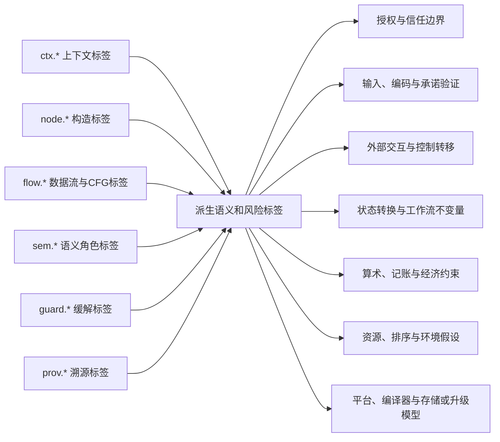
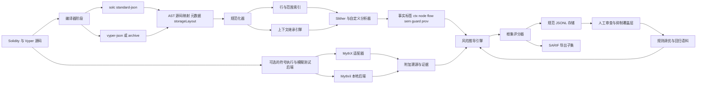

# 智能合约代码库行级根因标记系统设计

## 执行摘要

一个健壮的智能合约行级标记系统不应从数百个漏洞名称出发，而应从**一个小而稳定的内部根因覆盖集**出发，再向外映射到外部分类体系，如 OWASP SCWE、SWC/EIP-1470、EEA EthTrust 和 CVE/NVD。这一设计选择由这些工件实际扮演的角色所决定：SCWE 是一份维护中的智能合约弱点枚举，旨在作为 CWE 的补充以及 OWASP SCSVS 与 SCSTG 之间的桥梁；EIP-1470 将 SWC 定义为一种与 CWE 松散对齐的智能合约专属弱点分类方案；SWC 在线注册表明确声明其自 2020 年以来已不再积极维护，可能包含遗漏；EthTrust 提供的是面向认证的规范与检查清单；而 CVE/NVD 提供的是真实世界已披露的漏洞标识符、受影响版本上下文和严重性元数据，而非根因本体。

最实用的架构是**双层模型**。第一层是对所有可执行代码行提出的七集语义覆盖：**授权与信任边界**、**输入/编码/承诺验证**、**外部交互与控制转移**、**状态转换与工作流不变量**、**算术/记账/经济约束**、**资源/排序/环境假设**，以及**平台/编译器/存储/升级模型**。第二层是一个**可组合的标签本体**，用于记录具体证据：AST 构造、数据流、控制流、编译器版本、存储布局上下文、密码学操作、访问控制检查、可升级性机制、gas 与活性信号，以及缓解措施。这种分离使得内部模型在外部标准和新增 CVE 不断演进的同时仍能保持稳定。这一稳定性目标也与 OpenSCV 等学术工作的观点一致——后者认为 SWC 等早期方案已随着生态演化而变得异质或过时。

在实现层面，最可靠的基础是编译器原生的溯源信息。Solidity 编译器能够输出 AST、存储布局、元数据和字节码源码映射；源码映射同时存在于 AST 级别和字节码指令级别。Vyper 能够输出 AST、源码映射、存储布局、JSON 编译产物以及带有版本和完整性信息的可复现归档工件。Slither 在此基础上提供带源码位置的检测器、自定义检测器 API、Vyper 支持以及适合数据流和污点分析的 SlithIR SSA 形式中间表示。MythX 则补充了静态分析、符号分析和灰盒模糊测试，并将检测位置关联到 SWC 编号；Mythril 提供本地符号执行，但明确声明不覆盖业务逻辑错误的完备检测。

将**完整的逐行清单**持久化在规范的 JSONL 存储中，仅将**值得审查的子集**导出到 SARIF 中。GitHub 的 SARIF 摄入对 CI 和 Pull Request 很有用，但它要求 SARIF 2.1.0、依赖稳定的位置和 `partialFingerprints` 来跨运行去重，并对上传结果数量有实际限制。因此 SARIF 是一种交换/报告格式，而非"每条可执行行"的规范存储格式。应将原始行标签、派生集合得分、溯源、抑制和差异历史保留在 JSONL 或数据库中；仅将可疑、高优先级或变更过的发现导出到 SARIF。

最后，将**版本与依赖上下文视为一等证据**，而非元数据装饰。Vyper 和 OpenZeppelin 的真实 NVD 记录表明，编译器版本、库版本、代码生成 bug、签名验证假设、重复 `delegatecall`、治理抢跑、ERC2771 调用者重建以及财务记账缺陷都可能具有版本特异性。因此，一个有用的根因标记系统需要在受影响行上具备构建感知的上下文标签，而不仅仅是基于语法的检测器。

## 分类基础与七个根因集合

在定义七个集合之前，有必要厘清每个外部来源对设计的贡献。

| 框架 | 是什么 | 在本系统中的最佳用途 |
|---|---|---|
| **OWASP SCWE** | OWASP 维护的智能合约常见安全与隐私弱点列表；被描述为 CWE 的补充以及 SCSVS 与 SCSTG 之间的桥梁。它区分**弱点**与**漏洞**，并按 SCSVS 控制项组织条目。 | 用作维护中的弱点词汇表，以及示例映射和缓解措施的来源。 |
| **SWC / EIP-1470** | EIP-1470 将 SWC 定义为与 CWE 松散对齐的智能合约专属弱点分类方案，旨在为开发者、工具和审计者创建一种共同语言。SWC 在线注册表声明其自 2020 年以来未进行全面更新，可能包含错误和遗漏。 | 用于向后兼容、旧版测试用例，以及与旧工具和审计报告的互操作。 |
| **EEA EthTrust** | 面向认证的规范与配套检查清单；2025 年 3 月的检查清单声明该检查清单是便利性文档，规范才是权威。EthTrust 认证被明确界定为"声称经测试的代码不受到一组已知攻击或未按预期运行的失败的影响"，而非一揽子安全保障。 | 用作规范性需求层，特别是编译器/版本策略、外部调用、访问控制和升级治理方面。 |
| **CVE / NVD** | CVE 项目识别、定义和编目公开披露的漏洞，NVD 是 NIST 基于标准的漏洞管理存储库与扩充层。CVE 编号唯一标识漏洞，NVD 补充受影响版本信息、参考资料和评分。 | 用作真实世界示例映射、受影响版本标记和依赖/编译器风险上下文的经验证据。 |

本文提出的内部模型将代码库视为经过编译器源码映射投影后的可执行源代码行集合。

令：

- $L_{exec}$ = 受分析代码库中所有可执行源代码行
- $R = \{R_{auth}, R_{validate}, R_{flow}, R_{state}, R_{value}, R_{env}, R_{platform}\}$

设计目标为：

- 对于每个根因集合 $R_i$，有 $R_i \subseteq L_{exec}$
- $\bigcup_i R_i = L_{exec}$

这是一个**覆盖**，而非划分。某一行可以属于多个集合。这是必然的，因为重大智能合约故障往往是多因叠加的。例如，重入既是一个**外部交互/控制转移**问题，也是一个**状态转换时序**问题；`delegatecall` 既可能是一个**控制转移**问题，也可能是一个**平台/升级/存储上下文**问题。Solidity 自身的安全文档和 EthTrust 的检查-效果-交互要求明确体现了这一多因结构。

以下是七个根因集合的详细定义。

| 根因集合 | 该行回答的语义问题 | 典型被标记行 | 代表性的外部对齐 |
|---|---|---|---|
| **授权与信任边界** | *谁有权做这件事，基于何种信任假设？* | 调用者检查、角色检查、升级授权、暂停/取消暂停、自毁授权、meta-tx 调用者重建 | SCWE-016 和 SCWE-018 覆盖授权不足和 `tx.origin` 问题；SWC-115 和 SWC-106 覆盖 `tx.origin` 授权和未受保护的自毁；EthTrust 包含**禁止 `tx.origin`** 和**强制执行最小权限**；NVD CVE-2023-40014 展示了 `ERC2771Context` 中的调用者身份重建失败。 |
| **输入、编码与承诺验证** | *字节、参数、哈希、签名、nonce、长度、域和关键地址是否有效且无歧义？* | 零地址检查、calldata/returndata 长度检查、`abi.decode`、EIP-712 域检查、nonce 检查、重放保护逻辑、动态输入上的 `abi.encodePacked` | SCWE-022、SCWE-074、SCWE-120、SCWE-122 和 SCWE-143 涉及重放、哈希碰撞、返回数据长度、calldata 长度和关键地址验证；SWC-121、SWC-117 和 SWC-133 覆盖重放、可塑性签名和 packed 编码碰撞；CVE-2022-31172 展示了一个真实的签名验证假设失败案例。 |
| **外部交互与控制转移** | *控制权离开合约或信任边界时是否安全，失败模式是否被正确处理？* | 低级调用、`delegatecall`、`staticcall`、ETH/代币转账、回调接口、外部调用返回值处理 | SCWE-046、SCWE-048 和 SCWE-134 覆盖重入、未检查的调用返回值和向非合约地址的低级调用；SWC-104、SWC-107 和 SWC-112 覆盖未检查调用、重入和向不可信被调用方的 delegatecall；EthTrust 要求检查低级调用返回值并使用 CEI 防范重入。 |
| **状态转换与工作流不变量** | *状态变更是否按正确顺序执行，工作流不变量在执行前、中、后是否始终成立？* | 效果排序、陈旧读取、记账同步、治理动作构造、重复执行、不变量断言 | SCWE-137 强调通过陈旧视图状态的只读重入；SCWE-052 和 SCWE-037 涵盖顺序依赖和抢跑；CVE-2023-30542 和 CVE-2023-49798 是治理和 multicall 执行中具体的工作流/不变量失败案例。 |
| **算术、记账与经济约束** | *数值和经济不变量在溢出、截断、价格波动和记账更新下是否仍然成立？* | 余额/供应/债务更新、舍入逻辑、份额-价格数学、滑点边界、上限、最小/最大检查 | SCWE-047 覆盖整数溢出/下溢；SCWE-124 覆盖金融数学中的不一致舍入；SCWE-090 覆盖滑点保护缺失；SWC-101 覆盖溢出/下溢；EthTrust 包含溢出和舍入要求；NVD CVE-2023-26488 是一个具体的记账不一致案例。 |
| **资源、排序与环境假设** | *gas、活性、时间戳、排序、随机性和验证者控制的环境输入是否被安全地使用？* | 无界循环、时间戳敏感分支、`blockhash`/`prevrandao` 随机性、可被抢跑的治理或定价、截止时间检查 | Solidity 警告无界循环可能使合约停滞；SCWE-024、SCWE-052、SCWE-077、SCWE-084、SCWE-141 和 SCWE-153 覆盖弱随机性、顺序依赖、速率限制、blockhash 误用、截止时间和 `prevrandao`；MythX 也检测时间戳和环境变量对控制流及无界循环的影响；NVD CVE-2023-34234 是一个真实的抢跑案例。 |
| **平台、编译器与存储或升级模型** | *平台的实际执行模型在编译器、存储、库和代理语义层面是否保持了开发者的意图？* | 编译器版本上下文、内联汇编/Yul、代理升级行、存储布局敏感代码、已知 bug 触发模式、依赖版本敏感路径 | SCWE-039、SCWE-061、SCWE-089、SCWE-099 和 SCWE-150 覆盖内联汇编、过时的编译器版本、过时的库和存储布局碰撞；Solidity 发布机器可读的已知 bug 列表和编译器元数据；EthTrust 高度重视现代编译器和编译器 bug；Vyper 版本管理明确标注安全修复；Vyper 和 OpenZeppelin 的 NVD 记录展示了真实的编译器/库语义失败。 |

使用这七个集合而非直接用 SCWE 或 SWC 编号标记代码行的原因在于，外部分类体系过于细粒度且不够稳定，不适合作为**主要语义层**。OpenSCV 对早期方案的批评，加上 SWC 注册表自身关于维护陈旧的警告，强烈表明生产系统应当保留一个较小的内部根因层，将 SCWE、SWC、EthTrust 和 CVE 视作**映射目标和证据词汇表**，而非通用的语义基底。

## 标签本体与标签到集合的映射规则

本体应具备**结构化**、**可组合**和**溯源丰富**三个特性。扁平标签列表不足以支撑行级推理，因为同一行代码可能同时承载构造信息、数据流证据、缓解措施证据、平台上下文以及一个或多个派生的根因集合归属。

一个实用的模式使用八个标签族。

| 标签族 | 用途 | 示例 | 值形式 | 单行基数 |
|---|---|---|---|---|
| `ctx.*` | 继承的构建与环境上下文 | `ctx.compiler.solc=0.8.24`, `ctx.proxy.pattern=uups` | 参数化 | 一个或多个 |
| `node.*` | 直接的 AST/IR 构造事实 | `node.call.kind=delegatecall` | 枚举或布尔 | 一个或多个 |
| `flow.*` | 数据流、污点、支配关系和调用图关系 | `flow.user_input_to_call_target=true` | 布尔或关系 | 零或多个 |
| `sem.*` | 该行的操作语义或业务角色 | `sem.state.balance_write=true` | 布尔或枚举 | 可执行行一个或多个 |
| `guard.*` | 正面的缓解措施和加固控制 | `guard.flow.nonreentrant=present` | 枚举 | 零或多个 |
| `risk.*` | 派生的危险假设 | `risk.env.unbounded_loop=true` | 布尔或评分枚举 | 零或多个 |
| `prov.*` | 证据溯源 | `prov.slither.detector=reentrancy-eth` | 参数化 | 一个或多个 |
| `root.*` | 最终的根集合归属与得分 | `root.flow=0.97` | $[0,1]$ 区间得分 | 恰好一个主归属，可选辅助归属 |

使用**小写点分隔命名空间**，并倾向于**参数化值**而非将命名空间膨胀为大量近似重复项。例如，`guard.sig.replay_protection=nonce+domain` 优于为每种重放保护组合创建单独的 ad hoc 标签。同样，`ctx.dependency.openzeppelin.contracts=4.9.4` 优于为每个受影响版本创建单独的标签名。这也与 Solidity 元数据、EthTrust 一致性上下文和 Vyper 归档将版本化构建信息暴露为结构化数据而非自由文本的方式一致。

布尔标签适用于清晰的谓词，如"该行含有一个低级调用"。参数化标签更适用于版本、角色、槽位、gas 模式、代理模式、信任级别和重放保护强度。因此，行记录应支持：

- **布尔值**，用于直接事实
- **枚举**，用于受控的分类值
- **数字/范围**，用于版本、行跨度、gas 和槽位索引
- **关系**，用于污点/控制流边
- **得分**，用于派生的根集合置信度

标签到集合的关系最好建模为两步推导：

1. **事实 → 派生的风险或语义标签**
2. **派生标签 → 一个或多个根因集合**

这使系统保持可解释性。某行不仅应显示其映射到 `R_flow`，还应显示**原因**：例如，因为它是低级外部调用，其目标受到外部输入的污点污染，且其返回值未被检查。



一个好的规则引擎同时使用确定性映射和启发式方法。

| 规则类 | 示例 | 确定性 | 建议置信度 |
|---|---|---|---|
| **精确语法** | `node.call.kind=delegatecall` | 确定性 | 0.95–1.00 |
| **编译器已知 bug 触发** | 构建版本在受影响范围内**且** bug 谓词满足 | 确定性 | 1.00 |
| **过程内 CFG** | 状态写被外部调用支配，且未被重入保护支配 | 近似确定性 | 0.85–0.95 |
| **过程间污点** | 用户控制的地址传递到调用目标或授权谓词 | 启发式但较强 | 0.75–0.90 |
| **语义上下文继承** | 该行位于代理升级路径或受重放保护的 permit 路径内 | 启发式/上下文 | 0.60–0.85 |
| **回退父级继承** | 该行无直接证据，从最小可执行 AST 父节点继承主导集合 | 覆盖启发式 | 0.35–0.60 |

一个简单、可解释的评分函数为：

$$
score(r, l)=1-\prod_{e \in E(r,l)}(1-w_e)
$$

其中 $E(r,l)$ 是在行 $l$ 上支持根集合 $r$ 的证据项集合，$w_e$ 是证据权重。该行获得一个**主**根集合 $argmax_r score(r,l)$ 以及任何超过阈值的**辅助**根集合。这使得系统在数学上是完备的，同时保持 UI 可解释性。

最重要的映射原则是**覆盖而不失谨慎**。因为用户需求是标记**每一条可执行行**，所以每条可执行行至少应获得一个主集合，即使它当前并不可利用。换言之，系统标记的是该行的**安全责任域**，而不仅仅是可利用的缺陷。一条无害的 `require(msg.sender == owner)` 行仍属于**授权**领域；一条安全的余额更新仍属于**状态**（通常也属于**数值**）；一条有保护的外部调用仍属于**流程**。这是确保 $\bigcup_i R_i = L_{exec}$ 最干净的方式，而不必假装每一行都是一个发现。

## 逐行分析模型与自动化架构

行级模型应当忠实于编译器。对于 Solidity，编译器提供 AST 源码范围和字节码到源码的映射；AST 映射使用紧凑的 `s:l:f` 形式，而字节码源码映射使用压缩的 `s:l:f:j:m` 指令级条目。标准 JSON 编译器接口可以在一次可复现构建中输出 AST、元数据、存储布局和源码映射。Solidity 还发布机器可读的已知 bug 数据，包含受影响版本范围和触发条件。对于 Vyper，编译器可以输出 AST、源码映射、存储布局和 JSON 输出，而 Vyper 归档包含编译器版本、设置、完整性和可选的存储布局覆盖。Vyper 还强调安全性、可审计性、有界循环、禁止递归，以及通过 `@nonreentrant` 内置的重入保护。

由此引出以下逐行证据模型。

| 信号族 | 提取内容 | 首选来源 | 主导根集合 |
|---|---|---|---|
| **AST 和源码跨度事实** | 调用类型、修饰符、断言、循环、算术操作、`abi.decode`、`ecrecover`、`selfdestruct`、汇编块 | `solc` AST 与源码映射；Vyper AST 与源码映射 | 全部，尤其是验证、数值、平台 |
| **IR 与数据流** | 污点源、汇聚点、SSA 定义/使用、用户输入到授权/金额/调用目标/存储写 | Slither 与 SlithIR；自定义 Vyper 规范化 IR | 授权、验证、流程、数值 |
| **CFG 与支配关系** | 调用在写之前的顺序、保护覆盖、重入面、陈旧读取模式、活性路径 | Slither CFG；自定义 pass | 流程、状态、环境 |
| **编译器与依赖上下文** | 编译器版本、优化器/编辑模式、已知 bug 范围、依赖版本、元数据哈希 | Solidity 元数据与 bug 列表；Vyper 版本管理与归档；锁文件 | 平台 |
| **外部调用语义** | 低级调用类型、价值转移、返回值处理、目标信任级别、回调面 | AST、IR、检测器、ABI | 流程 |
| **存储与可升级性** | 代理模式、存储布局、槽位重叠风险、存储间隙使用、升级函数上下文 | `storageLayout`、Vyper 布局、代理识别器 | 平台、状态 |
| **访问控制** | 角色检查、所有者检查、`_msgSender()`、meta-tx 上下文、时间锁、多签敏感操作 | AST、调用图、继承上下文 | 授权 |
| **密码学与承诺** | EIP-712 域分离、nonce 使用、签名恢复流程、`abi.encodePacked`、VRF 回调验证 | AST、污点分析、语义 pass | 验证 |
| **Gas、活性与排序** | 无界循环、gas 转发、时间戳分支、区块随机性、排序敏感的治理/定价 | AST、CFG、污点分析、检测器 | 环境 |
| **证明或不变量信号** | `assert`、证明目标、消解的不变量、反例 | Solidity SMTChecker | 状态、数值 |

Slither 在此特别有用，因为它识别源码位置，同时支持 Solidity 和 Vyper，与 CI 及面向 Hardhat/Foundry 的构建集成，并在其 IR 之上暴露检测器 API。Slither 论文也明确将 SSA 形式、数据流和污点追踪列为核心能力。MythX 在 API 后端服务可接受时补充了静态分析、符号分析和灰盒模糊测试。Mythril 是一个不错的本地符号执行后备方案，但其文档称其针对常见漏洞，不能完备地发现业务逻辑问题，因此应被视为可选的证据来源而非唯一真理。



几个实现要点需要注意：

- Solidity 字节码源码映射是**指令级别**的，而非字节级别；映射器必须理解一条 `PUSH` 跨越多个字节但只对应一个源码映射条目。
- 源码映射可能使用文件 id `-1` 指向编译器生成或内部源码，Solidity 明确警告 `verbatim` 可能使源码映射失效；系统应将此类情况标记为**合成证据或降置信度证据**，而非静默地投影到任意的用户代码行。
- Vyper 应获得**语言默认的上下文标签**。由于 Vyper 在设计上排除了继承、修饰符、内联汇编、递归和无界循环，这些标签通常应被标记为 `impossible-by-language` 或 `not-applicable`，而非简单缺失。同时，Vyper 的 `raw_call`、编译器版本变更、存储布局覆盖和回调语义仍需一等公民级别的标记。

对于 CI，使用**增量多速流水线**：

- 每次 push 执行**快速变更文件扫描**
- PR 门禁执行**变更函数加上影响扩展的调用者/被调用者扫描**
- 夜间对整个仓库执行**全量扫描**，外加基准测试和历史 CVE 回归测试

这使系统在大型仓库中仍能保持实用，同时支撑全覆盖的行标记目标。

## 持久化、溯源、验证与存储格式

规范的持久化格式应为 **JSONL**，每行一条记录，对应一条可执行行或投影到行的规范可执行范围。SARIF 应被视为面向审查工作流、IDE 和代码扫描的**导出层**。这一建议基于结构和规模两方面的考虑：GitHub 的代码扫描仅支持 SARIF 2.1.0，使用 `partialFingerprints` 跨运行抑制重复，依赖稳定的物理位置，并对每次运行的结果数量设有实际限制。相比之下，完整的"每条可执行行"标记清单很容易超过代码扫描 UI 设计展示的容量。SARIF 的模式和 GitHub 的摄入模型确实通过属性包和位置结构支持额外元数据，这使得 SARIF 成为 JSONL 真值存储的一个良好**投影**。

一条良好的 JSONL 记录至少应包含：

- 仓库、提交与工件标识
- 文件路径、行号以及可选的列/范围
- 语言与编译器/依赖上下文
- 原始标签
- 派生的根集合得分
- 溯源与证据来源
- 审查与抑制覆盖层引用
- 用于差异匹配的稳定指纹

以下是一个简洁的 JSON Schema 示例。

```json
{
  "$schema": "https://json-schema.org/draft/2020-12/schema",
  "title": "sc-line-tag-record",
  "type": "object",
  "required": [
    "repo",
    "commit",
    "artifact",
    "location",
    "language",
    "tags",
    "rootSets",
    "rootScores",
    "provenance"
  ],
  "properties": {
    "repo": { "type": "string" },
    "commit": { "type": "string" },
    "artifact": {
      "type": "object",
      "required": ["path", "sha256"],
      "properties": {
        "path": { "type": "string" },
        "sha256": { "type": "string" },
        "role": { "type": "string", "enum": ["first_party", "dependency", "generated"] }
      }
    },
    "location": {
      "type": "object",
      "required": ["startLine", "endLine"],
      "properties": {
        "startLine": { "type": "integer", "minimum": 1 },
        "endLine": { "type": "integer", "minimum": 1 },
        "startColumn": { "type": "integer", "minimum": 1 },
        "endColumn": { "type": "integer", "minimum": 1 },
        "astNodeIds": {
          "type": "array",
          "items": { "type": "integer" }
        }
      }
    },
    "language": { "type": "string", "enum": ["solidity", "vyper"] },
    "buildContext": {
      "type": "object",
      "properties": {
        "compiler": { "type": "string" },
        "compilerVersion": { "type": "string" },
        "evmVersion": { "type": "string" },
        "optimizer": { "type": "boolean" },
        "proxyPattern": { "type": "string" }
      }
    },
    "tags": {
      "type": "array",
      "items": {
        "type": "object",
        "required": ["name", "family", "value"],
        "properties": {
          "name": { "type": "string" },
          "family": { "type": "string" },
          "value": {},
          "confidence": { "type": "number", "minimum": 0, "maximum": 1 }
        }
      }
    },
    "rootSets": {
      "type": "array",
      "items": {
        "type": "string",
        "enum": [
          "AUTH",
          "VALIDATE",
          "FLOW",
          "STATE",
          "VALUE",
          "ENV",
          "PLATFORM"
        ]
      }
    },
    "rootScores": {
      "type": "object",
      "properties": {
        "AUTH": { "type": "number", "minimum": 0, "maximum": 1 },
        "VALIDATE": { "type": "number", "minimum": 0, "maximum": 1 },
        "FLOW": { "type": "number", "minimum": 0, "maximum": 1 },
        "STATE": { "type": "number", "minimum": 0, "maximum": 1 },
        "VALUE": { "type": "number", "minimum": 0, "maximum": 1 },
        "ENV": { "type": "number", "minimum": 0, "maximum": 1 },
        "PLATFORM": { "type": "number", "minimum": 0, "maximum": 1 }
      }
    },
    "fingerprints": {
      "type": "object",
      "properties": {
        "lineFingerprint": { "type": "string" },
        "statementFingerprint": { "type": "string" },
        "functionFingerprint": { "type": "string" }
      }
    },
    "provenance": {
      "type": "array",
      "items": {
        "type": "object",
        "required": ["source", "kind"],
        "properties": {
          "source": { "type": "string" },
          "kind": { "type": "string" },
          "rule": { "type": "string" },
          "evidenceRef": { "type": "string" }
        }
      }
    },
    "review": {
      "type": "object",
      "properties": {
        "status": {
          "type": "string",
          "enum": ["unreviewed", "accepted", "suppressed", "waived", "fixed"]
        },
        "rationale": { "type": "string" },
        "expiresAt": { "type": "string", "format": "date-time" }
      }
    }
  }
}
```

对于 SARIF 导出，保留标准的 SARIF `locations` 和 `physicalLocation` 数据用于行/范围，将规则元数据放在标准规则对象中，并将标签清单和根集合得分附加在自定义属性命名空间（如 `sc.*`）下。同时生成 `partialFingerprints` 以在提交之间进行稳定的去重，因为 GitHub 明确使用它们来判断两个结果是否在逻辑上相同。

持久化策略还应显式处理溯源和审查者覆盖层。

| 关注点 | 推荐设计 |
|---|---|
| **位置标识** | 同时存储行和规范跨度。使用文件哈希、AST 路径、最近函数签名和规范化语句文本构建稳定指纹。 |
| **版本溯源** | 持久化编译器版本、编译器设置、EVM 目标、依赖版本、元数据哈希和分析器版本。EthTrust 在一致性声明中要求编译器选项和元数据；Solidity 元数据和 Vyper 归档已经暴露了所需字段。 |
| **差异处理** | 仅对变更文件和受影响函数重新计算，但通过行和语句指纹以及 SARIF 导出的 `partialFingerprints` 保持跨提交结果标识。 |
| **误报管理** | 绝不覆盖原始分析器输出。通过按指纹和分类版本键控的审查者覆盖层进行处理，抑制设置过期日期和必要理由。 |
| **语言特异性** | 对语言受限的情况显式标记不可能或不适用标签，尤其是在 Vyper 中。 |
| **生成或降置信度映射** | 使用 `coverageMode`（如 `exact`、`derived`、`inherited` 或 `synthetic`）区分可信标签与继承或编译器生成的投影。 |

验证应同时**以基准为驱动**和**经过人工审查**。SmartBugs 的价值在于其论文描述了一个包含 143 个已标注的漏洞合约和 208 个标记漏洞的精确数据集，以及一个规模更大的真实世界数据集。G-Scan 的价值在于它展示了行级定位是可行的，并报告了在行级重入定位上的强 F1 得分。同时，MythX 和 Mythril 都明确指出自动化并不能消除人工审查的必要性，尤其是在业务逻辑方面。

因此，严格的评估计划应至少度量四个层面：

| 度量族 | 度量内容 |
|---|---|
| **标签质量** | 单个标签的精确率、召回率和 F1 |
| **根集合质量** | 七个集合的宏/微 F1；主集合精确匹配准确率 |
| **定位质量** | 精确行匹配、行窗口召回率和跨度重叠 |
| **运营质量** | 审查者接受率、抑制率、置信度得分的校准度，以及每次 PR 的分析延迟 |

一个强有力的人机协同工作流是：

1. 分析器发出临时的行标签和根集合得分
2. 审查者仅对高于风险或不确定性阈值的行进行 triage
3. 分歧被裁定并纳入金标语料库
4. 根据裁定后的集合调整规则和得分阈值
5. 夜间在 CVE 复现、SmartBugs 和内部历史发现上运行回归测试

## 优先标签、注释示例、路线图与来源优先级

以下三十个标签是原型的最佳起点，因为它们覆盖了 Solidity 和 Vyper/EVM 中价值最高的语义面，同时保持可组合性。

| 标签 | 主集合 | 辅助集合 | 简短定义 | 示例模式 |
|---|---|---|---|---|
| `sem.auth.role_check` | AUTH | — | 调用者被检查是否匹配 owner、角色或 ACL | `require(hasRole(X, msg.sender))` |
| `risk.auth.tx_origin` | AUTH | — | 授权依赖 `tx.origin` | `require(tx.origin == owner)` |
| `sem.auth.privileged_operation` | AUTH | PLATFORM | 该行执行升级、暂停、铸币、清扫或破坏性管理操作 | `_upgradeTo(newImpl)` |
| `ctx.auth.meta_tx` | AUTH | VALIDATE | 调用者来自转发器感知的上下文 | `_msgSender()` |
| `guard.auth.timelock` | AUTH | ENV | 敏感操作需要延迟窗口 | `require(block.timestamp >= eta)` |
| `guard.input.zero_address` | VALIDATE | AUTH | 关键地址被验证为非零地址 | `require(to != address(0))` |
| `guard.input.length_check` | VALIDATE | FLOW | 字节或返回数据长度被检查 | `require(data.length >= 4)` |
| `sem.abi.decode_user_bytes` | VALIDATE | — | 用户控制的字节被解码 | `abi.decode(payload, (...))` |
| `risk.hash.encode_packed_dynamic` | VALIDATE | AUTH | 对多个动态值进行歧义哈希 | `keccak256(abi.encodePacked(a, b))` |
| `guard.sig.replay_protection` | VALIDATE | AUTH | 存在 nonce、域分隔符或已用哈希重放保护 | `require(!used[digest])` |
| `sem.call.low_level` | FLOW | — | 使用了低级外部交互 | `.call(...)`, `raw_call(...)` |
| `sem.call.delegatecall` | FLOW | PLATFORM | 执行上下文被委托给外部代码 | `delegatecall(data)` |
| `flow.user_input_to_call_target` | FLOW | AUTH | 外部输入可影响调用目标 | `target.call(data)` |
| `sem.call.value_transfer` | FLOW | VALUE | 外部交互转移 ETH/价值 | `.call{value: amt}("")` |
| `risk.call.unchecked_return` | FLOW | STATE | 外部结果被忽略或弱处理 | `callee.call(data);` |
| `guard.flow.nonreentrant` | FLOW | STATE | 存在重入保护 | `nonReentrant`, `@nonreentrant` |
| `risk.flow.state_write_after_call` | FLOW | STATE | 共享状态在外部调用之后更新 | `.call(...)` 之后的写入 |
| `sem.state.balance_write` | STATE | VALUE | 该行变更余额、供应、债务、授权或份额 | `balances[to] += amt` |
| `guard.state.invariant_check` | STATE | VALUE | 不变量被断言或要求 | `assert(total <= cap)` |
| `risk.state.stale_view_dependency` | STATE | FLOW | 该行参与陈旧读取或只读重入模式 | 在待定效果结算前读取数值 |
| `risk.math.unchecked` | VALUE | PLATFORM | 存在环绕算术或不安全转换路径 | `unchecked { total += x; }` |
| `risk.math.rounding_value_sensitive` | VALUE | STATE | 舍入方向可能改变经济结果 | 带除法的份额/资产数学 |
| `guard.value.slippage_bound` | VALUE | ENV | 存在经济容忍度或最小/最大边界 | `require(amountOut >= minOut)` |
| `risk.env.unbounded_loop` | ENV | FLOW | 循环边界依赖用户输入或存储增长 | `for(i; i < users.length; ++i)` |
| `risk.env.timestamp_sensitive` | ENV | AUTH | 价值敏感或授权敏感逻辑使用时间戳 | `if(block.timestamp > expiry)` |
| `risk.env.chain_randomness` | ENV | VALIDATE | 随机性依赖验证者控制的链上数据 | `blockhash`, `prevrandao` |
| `risk.env.tod_sensitive` | ENV | STATE | 该行参与交易顺序依赖行为 | 可被抢跑的提案或价格路径 |
| `ctx.compiler.version_risky` | PLATFORM | — | 当前构建版本处于风险或浮动范围 | 受影响的编译器或 pragma 上下文 |
| `ctx.storage.proxy_layout_sensitive` | PLATFORM | STATE | 该行在代理/共享存储上下文中执行 | 升级或代理敏感函数 |
| `ctx.platform.inline_assembly` | PLATFORM | VALIDATE | 该行位于 `assembly {}` 或 Yul 敏感路径内 | `assembly { sstore(...) }` |

部分标签在参数化使用时比仅标记存在或不存在更有价值。例如：

- `guard.sig.replay_protection = none | nonce | nonce+domain | nonce+domain+usedhash`
- `ctx.proxy.pattern = none | transparent | uups | beacon | minimal`
- `ctx.compiler.version_risky = none | floating | outdated | known_bug_match`
- `risk.env.timestamp_sensitive = low | medium | high`
- `flow.user_input_to_call_target = direct | indirect_storage | role_gated`

上述三十个标签到集合的映射总结如下。

| 标签组 | 映射到的根集合 |
|---|---|
| `sem.auth.*`、`risk.auth.*`、`guard.auth.*` | 主要为 AUTH |
| `guard.input.*`、`sem.abi.*`、`risk.hash.*`、`guard.sig.*` | 主要为 VALIDATE |
| `sem.call.*`、`risk.call.*`、`guard.flow.*`、带调用汇聚的 `flow.*` | 主要为 FLOW |
| `sem.state.*`、`guard.state.*`、`risk.state.*` | 主要为 STATE |
| `risk.math.*`、`guard.value.*`、`sem.state.balance_write` | 主要为 VALUE |
| `risk.env.*`、时间戳/随机性/排序/循环标签 | 主要为 ENV |
| `ctx.compiler.*`、`ctx.storage.*`、`ctx.platform.*`、汇编或编译器已知 bug 标签 | 主要为 PLATFORM |

以下是一些简短注释示例，展示了多标签行映射应如何工作。

| ID | 语言 | 代码片段 | 关键标签 | 根集合 | 注释 |
|---|---|---|---|---|---|
| A | Solidity | `require(tx.origin == owner);` | `risk.auth.tx_origin`, `sem.auth.role_check` | AUTH | 直接的调用者-授权 bug 面 |
| B | Solidity | `(bool ok,) = msg.sender.call{value: share}("");` | `sem.call.low_level`, `sem.call.value_transfer` | FLOW, VALUE | 外部交互主导该行语义 |
| C | Solidity | 在 B **之后** `shares[msg.sender] = 0;` | `risk.flow.state_write_after_call`, `sem.state.balance_write` | STATE, FLOW, VALUE | 同一漏洞族，不同的因果行 |
| D | Solidity | `bytes32 h = keccak256(abi.encodePacked(admins, users));` | `risk.hash.encode_packed_dynamic` | VALIDATE, AUTH | 影响授权的歧义承诺 |
| E | Vyper | `success: bool = raw_call(target, payload, revert_on_failure=False)` | `sem.call.low_level`，若 `success` 未使用则加 `risk.call.unchecked_return` | FLOW | Vyper 特有的调用形式 |
| F | Solidity | `_upgradeToAndCall(newImpl, data);` | `sem.auth.privileged_operation`, `ctx.storage.proxy_layout_sensitive` | AUTH, PLATFORM, STATE | 升级行继承存储/代理上下文 |

推荐的原型路线图分为三个阶段。

| 阶段 | 范围 | 预估周期 | 主要交付物 |
|---|---|---|---|
| **基础** | 编译器规范化、可执行行索引、初始本体、JSONL 存储、首批 12–15 个确定性标签 | **3–4 周** | Solidity 与 Vyper 摄入、AST/源码映射投影、初始根集评分器 |
| **信号融合** | Slither 集成、CFG 与污点 pass、编译器/依赖风险上下文、SARIF 子集导出、前 30 个标签覆盖 | **4–6 周** | 可供 CI 使用的引擎，含溯源、指纹、抑制和得分解释 |
| **验证与调优** | SmartBugs/SWC/CVE 回归语料、审查者 UI 或工作流、校准、误报降低、策略门禁 | **3–5 周** | 基准报告、阈值调优、审查操作手册、上线标准 |

最优先参考和实践化的来源如下。

| 来源族 | 重要性 |
|---|---|
| **OWASP SCWE and SCSVS** | SCWE 正在维护中，明确区分弱点与漏洞，设计目标是在 SCSVS 和 SCSTG 之间建立桥梁；它是映射示例与缓解措施的最佳维护中的弱点词汇表。 |
| **SWC registry and EIP-1470** | 仍被众多工具和报告广泛引用；EIP-1470 解释了 SWC 的概念模型和测试用例目的，尽管注册表已陈旧。 |
| **EEA EthTrust specification and checklist** | 版本感知需求、外部调用、编译器策略、最小权限和认证式审查标准的最佳规范性来源。 |
| **NVD/CVE records for compilers and libraries** | 对于版本感知的上下文标签以及基于真实事件的回归测试必不可少。Vyper 和 OpenZeppelin 的 CVE 尤其有价值。 |
| **Solidity docs** | 对于源码映射、standard-json 输出、元数据、已知编译器 bug、安全考量、存储布局和 SMTChecker 至关重要。 |
| **Vyper docs** | 对于源码映射、布局、JSON 接口、归档、完整性、有界循环、`@nonreentrant` 和发布/版本策略至关重要。 |
| **Slither docs and paper** | 面向 AST/IR/数据流/污点分析的最佳开源前端，具备 CI 集成、自定义检测器、源码定位和 Vyper 支持。 |
| **MythX and Mythril docs** | 对于可选的符号执行/模糊测试证据以及理解通用自动化在业务逻辑上的局限很有用。 |
| **SmartBugs and G-Scan** | SmartBugs 是一个实用的评估语料库；G-Scan 有力地证明了行级定位是可实现和可度量的。 |
| **OpenSCV** | 为为什么内部稳定的根因层应与外部漏洞目录分离提供了有益的理论支撑。 |

**开放问题与局限。**本报告明确的是 **Solidity 与 Vyper 在 EVM 上**的设计。其他智能合约生态和语言有意不在规格范围内。本报告还假设逐行标记是一种**安全语义责任模型**，而非声称每一条被标记的代码行都是可被利用的。这一区分很重要，因为 SCWE 自身也区分弱点与漏洞，而 MythX 和 Mythril 等现实工具也明确不排除在业务逻辑上需要人工审查的必要性。
